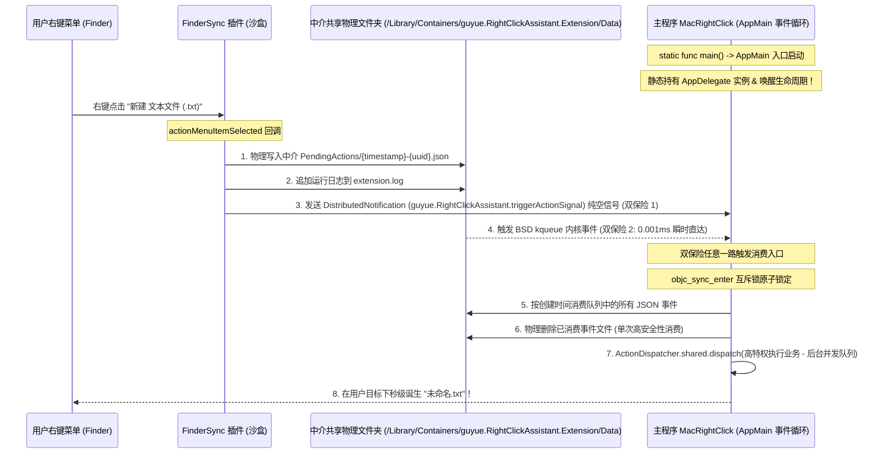

# 🍏 MacRightClick — 开源 macOS 右键助手

[English Version](README_EN.md) | [中文版](README.md)

<p align="center">
  
</p>

<p align="center">
  <a href="https://github.com/guyue55/MacRightClick/actions"></a>
  
  
  
</p>

---

## 🌟 项目简介

**MacRightClick** 是一款专为 macOS 设计的免费开源**右键上下文菜单（Context Menu）增强助手**。它支持 28 种日常右键操作，包括新建多种格式文档、打开终端或编辑器、提取文件哈希、生成二维码、图片格式转换等。项目采用 **“分布式信号 + BSD kqueue (DispatchSource)”** 的队列化分发机制，兼顾 FinderSync 扩展、站外分发和本地开发调试场景。

---

## ✨ 核心特性

- 🚀 **队列化动作消费**：右键点击会写入独立 UUID 事件文件，宿主 App 按顺序消费，避免连续点击覆盖单个 pending 文件。
- 🔒 **清晰的共享通道**：当前官网分发路线使用扩展沙盒中介目录保持 Ad-hoc 与 Developer ID 环境路径一致；通过队列化数据中介与双通道信号机制，规避强沙盒下 DistributedNotification `userInfo` 被剥离的问题。若未来切换 Mac App Store，应改为正式 App Group 与 security-scoped access。
- 🎨 **非阻塞磨砂玻璃 HUD**：彻底弃用传统的同步阻塞弹窗，独创实现了带有原生 macOS 磨砂玻璃、圆角卡片、淡入淡出微动画、2.5 秒自动关闭的非模态 `NSPanel` 浮动通知面板（HUD），不强占系统焦点，体验极其优雅。
- 🦁 **现代 SMAppService 登录项自启**：依托 macOS 13+ `SMAppService` API 注册登录项。用户可在系统的“系统设置 -> 通用 -> 登录项”中管理。
- ✂️ **访达已剪切文件原生状态角标**：原生利用 `FIFinderSyncController` 的 Badging 功能，为处于“已剪切”挂起状态下的文件、文件夹渲染精致的剪刀角标。且结合分布式通知信号触发 Finder 秒级重绘，彻底解决以往用户“不知道是否成功剪切”的交互痛点。
- 🔋 **系统托盘与 Dock 无缝转换**：支持退入系统托盘常驻运行。偏好设置红叉拦截，在退出时隐藏 Dock 栏并将 AppKit 策略调整为 `.accessory` 以达到极轻量常驻；点击托盘时重新挂载为 `.regular` 并置顶，保障高贵的苹果原生手感。
- 🖥️ **Universal 2 双架构支持**：支持 Apple Silicon (M1/M2/M3/M4) 与 Intel (x86_64) 双架构编译。

---

## 🛠️ 功能矩阵 (28 大核心动作)

| 📂 新建文件类 | 📝 文件管理类 | 💻 终端与编辑器 | 🧰 实用小工具 |
| :--- | :--- | :--- | :--- |
| - 新建 `.txt` 文本文档<br>- 新建 `.md` Markdown 文档<br>- 新建 `.json` 数据包<br>- 新建 `.csv` 数据表格<br>- 新建 `.html` 网页文档<br>- 新建 `.docx` Word 骨架<br>- 新建 `.xlsx` Excel 骨架<br>- 新建 `.pptx` PowerPoint 骨架<br>- 新建 `.pdf` PDF 骨架 | - 剪切文件 (Cut)<br>- 粘贴文件 (Paste)<br>- 永久删除（高级，默认关闭）<br>- 拷贝文件完整路径<br>- 拷贝文件名<br>- 复制到...（高级，默认关闭）<br>- 移动到...（高级，默认关闭） | - 在当前目录打开终端 (Terminal)<br>- 在当前目录打开 iTerm2<br>- 在当前目录打开 Warp<br>- 用 VSCode 打开目标<br>- 用 Sublime Text 打开目标<br>- 用 Cursor 打开目标 | - 提取文件 MD5 校验码<br>- 提取文件 SHA256 校验码<br>- 切换系统隐藏文件显示状态（高级，默认关闭）<br>- 从剪贴板生成二维码窗口<br>- 转换为 PNG 格式图片<br>- 转换为 JPEG 格式图片 |

---

## 📐 穿透分发架构

MacRightClick 采用集中式**数据通道隔离抽象层**：上层 Action 逻辑、SwiftUI 界面和 Finder 访达交互由 `SharedStorageManager` 托管，底层负责队列事件、配置文件和共享日志。



---

## ⚡ 快速开始与下载

### 📥 官方发布版下载

推荐下载 **Universal 2 双架构 (Apple Silicon + Intel x86_64)** 磁盘映像包。正式发布版应使用 Developer ID 签名、Hardened Runtime、Apple notarization 与 stapler 附票；本地开发版仍可使用 Ad-hoc 签名调试。

| 📦 格式 | 下载链接 | 适用场景 & 特性 |
| :--- | :--- | :--- |
| **磁盘映像 (DMG)** | [下载最新 RightClickAssistant-Latest.dmg](https://github.com/guyue55/MacRightClick/releases/latest/download/RightClickAssistant-Latest.dmg) | 推荐。拖拽即可安装，适合常规使用。 |
| **绿色压缩包 (ZIP)** | [下载最新 RightClickAssistant-Latest.zip](https://github.com/guyue55/MacRightClick/releases/latest/download/RightClickAssistant-Latest.zip) | 解压即可运行，适合测试或临时使用。 |

> [!TIP]
> 📌 **所有历史版本与更新日志**：您可以随时访问 [GitHub Releases 页面](https://github.com/guyue55/MacRightClick/releases) 查阅所有的历史发布版本、多架构安装包以及详尽的 Release Note 演进过程。

---

### 🚢 分发路线

当前项目主路线是 **官网 / GitHub Releases 站外分发**。正式发布时使用：
```bash
DISTRIBUTION_ROUTE=website-release \
DEVELOPER_ID_APPLICATION="Developer ID Application: Your Name (TEAMID)" \
NOTARY_PROFILE="your-notarytool-profile" \
./Scripts/build.sh
```

这条路线会启用 Developer ID 签名、Hardened Runtime、notarytool 提交、公证完成后对 `.app` 与 `.dmg` 执行 `stapler staple`。

Mac App Store 不是当前默认路线。若未来切换到 Mac App Store，需要先恢复主 App sandbox、正式 App Group、security-scoped access/bookmarks，并重新评估永久删除、重启 Finder、跨目录移动等高级动作的审核与权限边界。

### 🛠️ 1. 本地自动化编译
根目录下配备了标准的 Universal 2 多架构极速编译打包工具：
```bash
./Scripts/build.sh
```
编译完成后，制品将保存在 `build/` 目录下：
* 📍 宿主应用路径: `build/RightClickAssistant.app`
* 📦 分发 Zip 包路径: `build/RightClickAssistant.zip`

### 2. 本机自检
项目包含本机验证工具。您可以通过以下命令执行编译、卸载旧包、部署、拉起进程并运行核心断言测试：
```bash
./Scripts/build.sh && ./Scripts/uninstall.sh && cp -R build/RightClickAssistant.app /Applications/ && open /Applications/RightClickAssistant.app && sleep 5 && ./ActionVerifier_bin
```
**自检输出报告**：
```text
==============================================================================
📊 [Verifier] 物理自检结束！
🟢 通过项: 10 / 10
🔴 失败项: 0 / 10
==============================================================================
✅ [Verifier] 验证通过：多进程动作队列、生命周期与核心 Action 逻辑符合预期。
```

### 3. 卸载
自检完成后，您可以运行内置卸载脚本，注销 Finder 扩展、清理沙盒缓存，并重启 Finder 释放扩展会话：
```bash
./Scripts/uninstall.sh
```

---

## ⚠️ 安装运行排阻与常见问题 (Q&A)

由于本开源项目在本地使用 Ad-Hoc 临时自签名编译（未向苹果公司缴纳年费购买商业开发者证书并进行官方公证 Notarization），其他用户在下载并安装、运行此软件时，可能会遇到 macOS 系统级安全防御拦截。请按照以下步骤轻松排除：

### Q1: 双击运行时提示“应用已损坏，打不开”或“无法验证开发者”？
* **原因**：macOS Gatekeeper 安全机制对非商业证书签名的外来下载软件会自动打上“隔离属性”并拦截运行。
* **解决办法**：
  1. 将应用拖入 `/Applications` 文件夹；
  2. 打开系统的 **终端 (Terminal)** 软件，执行以下命令物理移除隔离标记：
     ```bash
     xattr -cr /Applications/RightClickAssistant.app
     ```
  3. 重新双击运行应用。

### Q2: 右键菜单在访达 (Finder) 里不显示？或者在“系统设置 -> 扩展”中找不到“右键助手扩展”？
* **原因**：macOS 默认不会在系统后台自动注册和激活第三方的 FinderSync 插件。特别是在本地编译、或者是从浏览器下载但未将其移动到 `/Applications` 文件夹、以及存在 Gatekeeper 隔离标记时，系统的 `pluginkit` 守护进程会漏掉扫描注册。
* **解决办法（极简智能推荐）**：
  * **主程序引导**：主程序会读取当前 macOS 系统版本，并在主界面中显示对应的扩展启用步骤与系统设置入口。
  * **终端手动注册**：
    若您在扩展页面中找不到“右键助手”，请打开 Mac 的 **终端 (Terminal.app)**，执行以下注册命令：
    * **场景 A：如果您已将 App 安装在 `/Applications`（推荐）**：
      ```bash
      pluginkit -a /Applications/RightClickAssistant.app/Contents/PlugIns/RightClickAssistantExtension.appex
      ```
    * **场景 B：如果您是在克隆的源码目录本地编译**：
      ```bash
      pluginkit -a \$(pwd)/build/RightClickAssistant.app/Contents/PlugIns/RightClickAssistantExtension.appex
      ```
    注册成功后，可以在终端执行 `killall Finder` 重启访达，再次进入扩展页面检查是否可勾选启用。
  * **手动备用步骤**：
    1. 打开 Mac 的 **系统设置 (System Settings)**；
    2. 依次进入：**隐私与安全性 (Privacy & Security) -> 扩展 (Extensions)**；
    3. 双击点击 **访达 (Finder)** 选项；
    4. 找到 **“右键助手扩展”**，手动将其**勾选勾亮**开启服务；
    5. 若尚未显示，可右键点开一个 Finder 窗口，或在终端执行 `killall Finder` 重启访达。

### Q3: 主程序没有界面时，右键增强菜单还生效吗？
* **原因**：MacRightClick 的架构属于“**双通道多进程沙盒穿透分发**”架构。Finder 菜单负责展示，真正的业务（如新建 Word 骨架、计算哈希等高特权文件读写）是由主 App 在后台常驻处理的。
* **解决办法**：
  * 主 App 在刚拉起时，已通过 `ProcessInfo.beginActivity` 申请了**系统级高优保活豁免**，确保不被 macOS App Nap 机制挂起和冻结；
  * 主 App 支持点击红叉后隐藏到系统菜单栏，并在设置界面支持“开机自启动”（基于 macOS `SMAppService` 机制）。如果你希望右键服务随登录启动，可以开启此项。

### 隐私与安全

- 项目不包含广告，也不会主动收集或上传使用数据。
- 详细调试日志默认关闭。开启后，日志可能包含菜单渲染、路径监听和动作过滤信息，请仅在排查问题时使用。
- 高风险动作（永久删除、跨目录复制/移动、切换隐藏文件）默认关闭，并在执行前显示确认。
- 正式站外发布版应使用 Developer ID、Hardened Runtime、Apple notarization，并对 `.app` 与 `.dmg` 执行 stapler 附票。

---

## 🛡️ 许可证 (License)

本项目基于 [MIT](LICENSE) 开源许可证。
