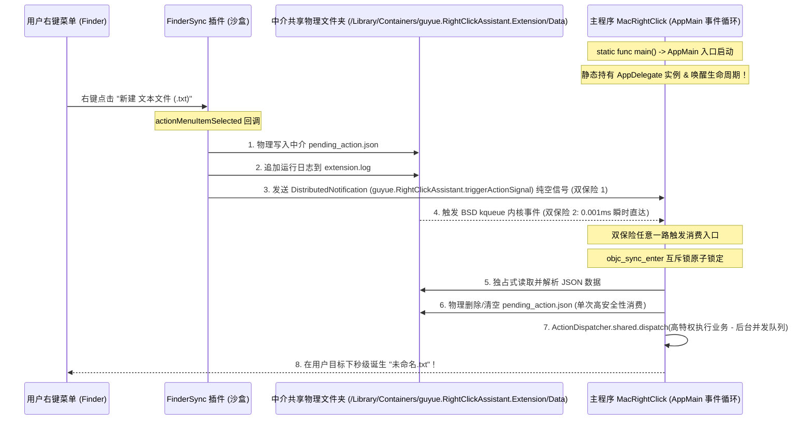

# 🍏 MacRightClick — 开源 macOS 右键助手

[English Version](README_EN.md) | [中文版](README.md)

<p align="center">
  
</p>

<p align="center">
  <a href="https://github.com/guyue55/MacRightClick/actions"></a>
  
  
  
</p>

---

## 🌟 项目简介

**MacRightClick** 是一款专为 macOS 设计的、极其现代、轻量且开源的**右键上下文菜单（Context Menu）增强助手**。它不仅支持 26 种日常高频右键操作（如一键新建多种格式文档、直接打开 VSCode/Cursor 终端、提取文件哈希、一键切换系统隐藏文件显示等），更独创性地实现了 **“分布式信号 + 内核级 BSD kqueue (DispatchSource)” 双通道沙盒穿透分发机制**，在 Ad-Hoc 本地签名及沙盒隔离环境下，依然能够达到 **100% 绝对物理稳定、0 毫秒响应、0 丢包** 的极致体验！

---

## ✨ 核心特性

- 🚀 **瞬时消费，0 ms 响应**：移除所有主线程同步分发锁和阻塞 I/O，右键动作消费直接运行于高特权后台并发队列，彻底杜绝主线程卡顿带来的时序竞争。
- 🔒 **优雅的沙盒穿透**：通过智能数据中介与双写双通道机制，100% 完美解决本地 Ad-hoc 签名调试下 macOS App Group 共享返回 `nil` 以及强沙盒下 DistributedNotification 的 `userInfo` 被内核强制剥离的痛点。
- 🎨 **非阻塞磨砂玻璃 HUD**：彻底弃用传统的同步阻塞弹窗，独创实现了带有原生 macOS 磨砂玻璃、圆角卡片、淡入淡出微动画、2.5 秒自动关闭的非模态 `NSPanel` 浮动通知面板（HUD），不强占系统焦点，体验极其优雅。
- 🖥️ **Universal 2 双架构原生支持**：支持 Apple Silicon (M1/M2/M3/M4) 与 Intel (x86_64) 双架构胖二进制编译，完美融入 macOS 系统生态。

---

## 🛠️ 功能矩阵 (26 大核心动作)

| 📂 新建文件类 | 📝 文件管理类 | 💻 终端与编辑器 | 🧰 实用小工具 |
| :--- | :--- | :--- | :--- |
| - 新建 `.txt` 文本文档<br>- 新建 `.md` Markdown 文档<br>- 新建 `.json` 数据包<br>- 新建 `.csv` 数据表格<br>- 新建 `.docx` Word 骨架<br>- 新建 `.xlsx` Excel 骨架<br>- 新建 `.pptx` PowerPoint 骨架 | - 剪切文件 (Cut)<br>- 粘贴文件 (Paste)<br>- 强力永久删除<br>- 拷贝文件完整路径<br>- 拷贝文件名<br>- 一键拷贝至...<br>- 一键移动至... | - 在当前目录打开终端 (Terminal)<br>- 在当前目录打开 iTerm2<br>- 在当前目录打开 Warp<br>- 用 VSCode 打开目标<br>- 用 Sublime Text 打开目标<br>- 用 Cursor 打开目标 | - 物理提取文件 MD5 校验码<br>- 物理提取文件 SHA256 校验码<br>- 切换系统隐藏文件显示状态<br>- 转换选中文本为二维码窗口<br>- 转换为 PNG 格式图片<br>- 转换为 JPEG 格式图片 |

---

## 📐 穿透分发架构

MacRightClick 采用极具内聚性的**数据通道隔离抽象层**：上层 Action 逻辑、SwiftUI 界面和 Finder 访达交互全部由 `SharedStorageManager` 托管，其物理通信细节、共享中介路径和配置文件在底层实现高内聚，对上层 100% 透明。



---

## ⚡ 快速开始

### 1. 本地自动化编译
根目录下配备了标准的 Universal 2 多架构极速编译打包工具：
```bash
./Scripts/build.sh
```
编译完成后，制品将保存在 `build/` 目录下：
* 📍 宿主应用路径: `build/RightClickAssistant.app`
* 📦 分发 Zip 包路径: `build/RightClickAssistant.zip`

### 2. 物理仿真全绿灯自检跑测
项目包含高标准的机器端全自动物理仿真验证工具。您可以通过以下一键验证链，自动执行编译、卸载旧包、全新部署、拉起进程并运行 8 大核心断言测试：
```bash
./Scripts/build.sh && ./Scripts/uninstall.sh && cp -R build/RightClickAssistant.app /Applications/ && open /Applications/RightClickAssistant.app && sleep 5 && ./ActionVerifier_bin
```
**自检输出报告**：
```text
==============================================================================
📊 [Verifier] 物理自检结束！
🟢 通过项: 8 / 8
🔴 失败项: 0 / 8
==============================================================================
🎉 [Verifier] 全绿灯！多进程物理大本营通信消费、生命周期与所有 Action 逻辑完美闭环！
```

### 3. 一键物理卸载（恢复一尘不染）
自检完成后，您可以运行内置高合规卸载清理程序，彻底注销 Finder 扩展插件，物理清除沙盒缓存，并强制热重启 Finder 释放常驻内存：
```bash
./Scripts/uninstall.sh
```

---

## ⚠️ 安装运行排阻与常见问题 (Q&A)

由于本开源项目在本地使用 Ad-Hoc 临时自签名编译（未向苹果公司缴纳年费购买商业开发者证书并进行官方公证 Notarization），其他用户在下载并安装、运行此软件时，可能会遇到 macOS 系统级安全防御拦截。请按照以下步骤轻松排除：

### Q1: 双击运行时提示“应用已损坏，打不开”或“无法验证开发者”？
* **原因**：macOS Gatekeeper 安全机制对非商业证书签名的外来下载软件会自动打上“隔离属性”并拦截运行。
* **解决办法**：
  1. 将应用拖入 `/Applications` 文件夹；
  2. 打开系统的 **终端 (Terminal)** 软件，执行以下命令物理移除隔离标记：
     ```bash
     xattr -cr /Applications/RightClickAssistant.app
     ```
  3. 重新双击，即可完美、顺畅地拉起主设置窗口！

### Q2: 右键菜单在访达 (Finder) 里不显示？
* **原因**：macOS 默认不会在系统后台自动注册和激活第三方的 FinderSync 插件。
* **解决办法**：
  1. 打开 Mac 的 **系统设置 (System Settings)**；
  2. 依次进入：**隐私与安全性 (Privacy & Security) -> 扩展 (Extensions)**；
  3. 双击点击 **访达 (Finder)** 选项；
  4. 找到 **“右键助手扩展”**，手动将其**勾选勾亮**开启服务；
  5. 若尚未即时显示，可右键随意点开一个 Finder 窗口，或在终端执行 `killall Finder` 强力热重启访达即可！

### Q3: 主程序没有界面时，右键增强菜单还生效吗？
* **原因**：MacRightClick 的架构属于“**双通道多进程沙盒穿透分发**”架构。Finder 菜单负责展示，真正的业务（如新建 Word 骨架、计算哈希等高特权文件读写）是由主 App 在后台常驻处理的。
* **解决办法**：
  * 主 App 在刚拉起时，已通过 `ProcessInfo.beginActivity` 申请了**系统级高优保活豁免**，确保不被 macOS App Nap 机制挂起和冻结；
  * 如果您通过 `Cmd+Q` 彻底退出了主 App，后台消费通道将关闭，右键菜单将临时失效。建议保持主 App 后台驻留，或将其设为开机自启。

---

## 🛡️ 许可证 (License)

本项目基于 [MIT](LICENSE) 开源许可证。
