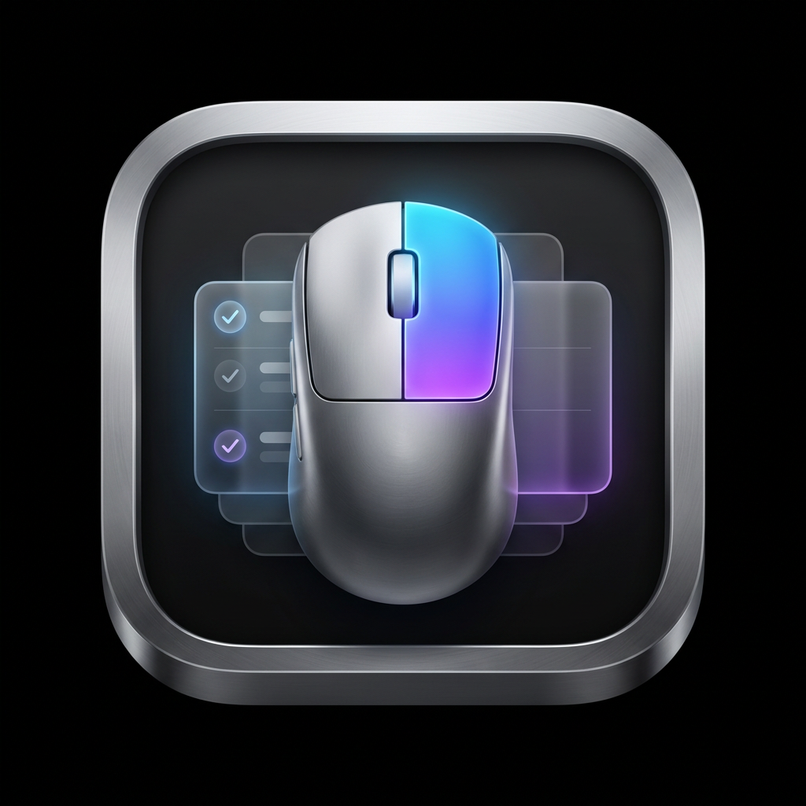
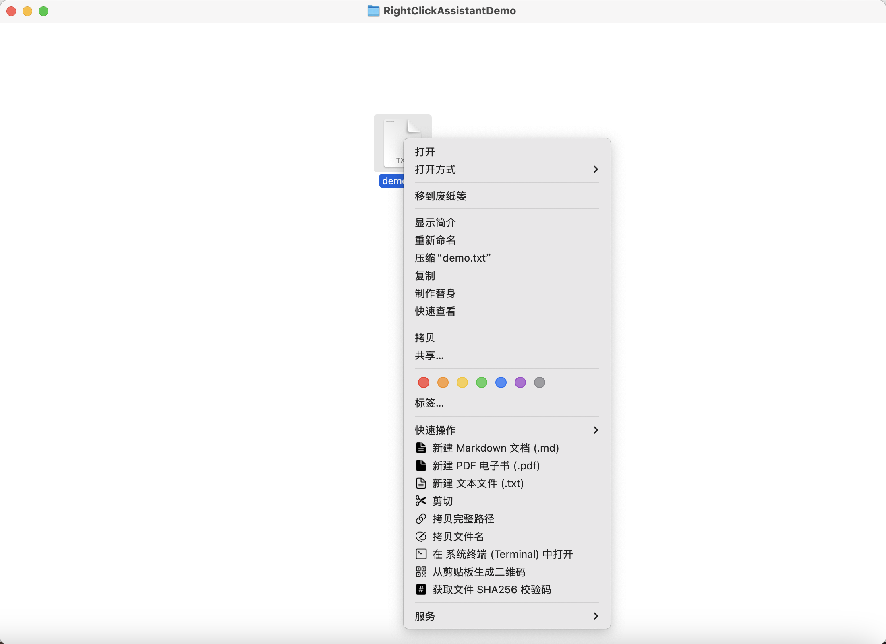
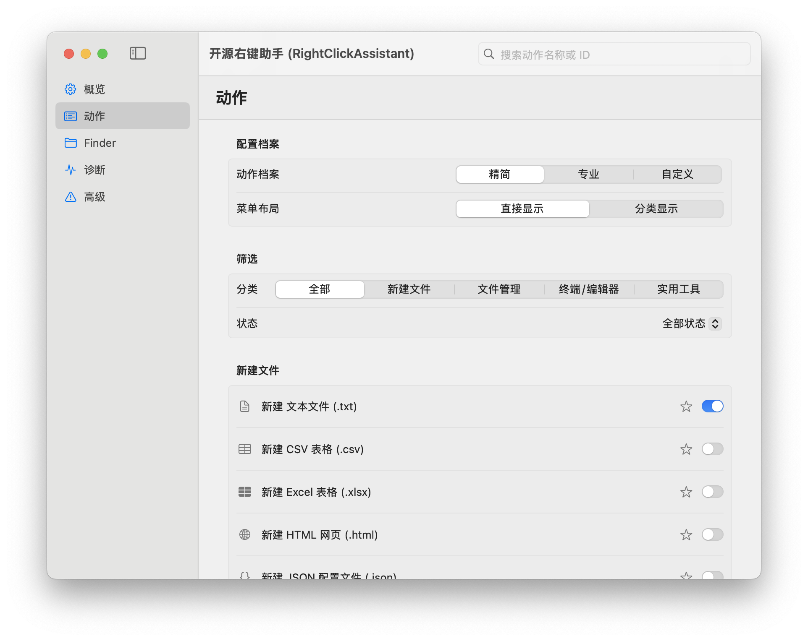
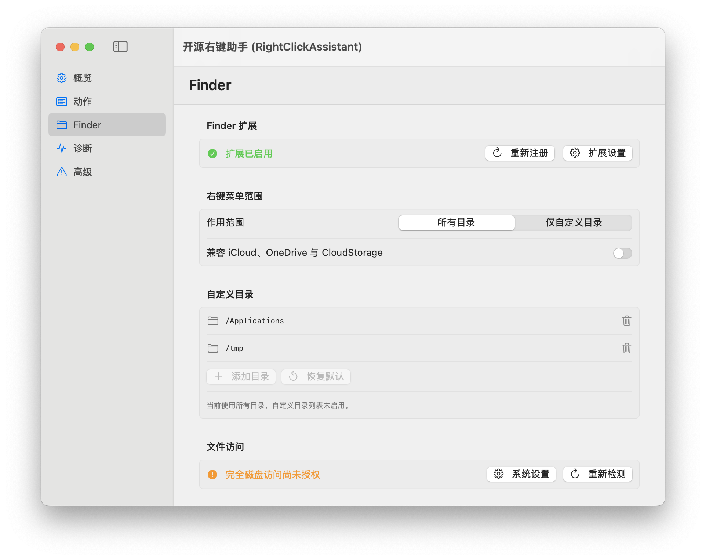
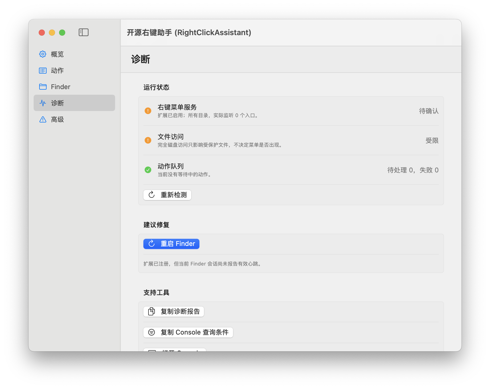
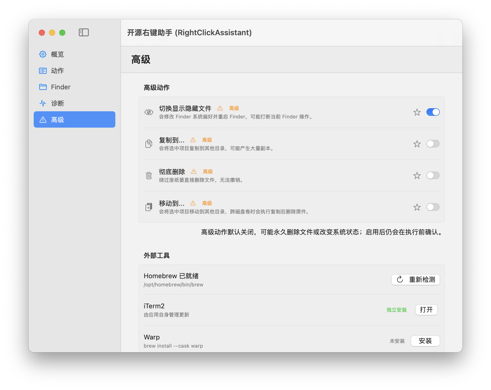
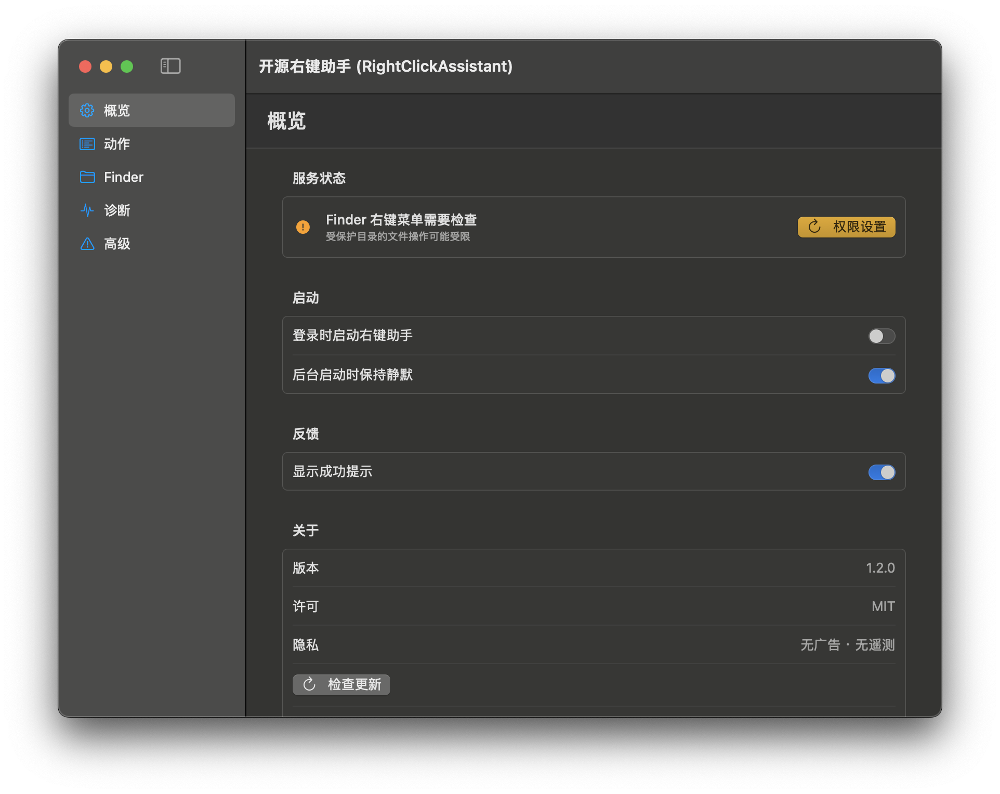
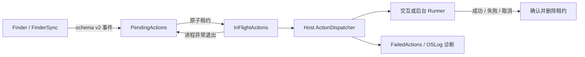

# MacRightClick

[English](README_EN.md) | 简体中文

<p align="center">
  
</p>

<p align="center">
  <a href="https://github.com/guyue55/MacRightClick/actions"></a>
  
  
  
</p>

MacRightClick 是一款免费、开源的 macOS Finder 右键菜单助手。当前源码注册 **30 个动作**，默认把已启用且适用于当前选中项的动作直接显示在一级菜单中；也可切换为分类子菜单。

项目由 FinderSync 扩展负责菜单与上下文采集，宿主 App 负责文件操作、交互与后台任务。它不包含广告、遥测或后台更新轮询。

## 界面

| Finder 一级菜单 | 动作与档案 |
| :---: | :---: |
|  |  |

| Finder 与权限 | 健康诊断 |
| :---: | :---: |
|  |  |

| 高级与外部工具 | 深色模式 |
| :---: | :---: |
|  |  |

## 主要能力

- **30 个内置动作**：新建文件、剪切粘贴、路径复制、终端/编辑器、哈希、二维码和图片转换。
- **一级菜单默认开启**：收藏动作置顶但不额外拉开大段间距；可切换分类菜单。
- **动作档案**：精简、专业、自定义三档；高级动作不会被档案批量开启。
- **快速检索**：按标题、动作 ID、分类和状态筛选。
- **全目录或自定义范围**：默认覆盖 Finder 常用目录、系统根目录和外接卷；可收窄到自定义目录。
- **健康诊断**：分别展示菜单服务、完全磁盘访问和动作队列，并只推荐一个优先修复动作。
- **可靠动作队列**：Pending -> InFlight -> 终态确认；宿主异常退出后可回收未完成租约。
- **显式更新检查**：只有点击“检查更新”才访问 GitHub Release API。
- **Homebrew 外部工具**：用户点击后可安装或更新 iTerm2、Warp、VS Code、Sublime Text、Cursor。
- **Universal 2**：同时支持 Apple Silicon 与 Intel Mac。

## 30 个动作

| 类别 | 数量 | 动作 |
| --- | ---: | --- |
| 新建文件 | 9 | `.txt`、`.md`、`.json`、`.csv`、`.html`、`.docx`、`.xlsx`、`.pptx`、`.pdf` |
| 文件管理 | 9 | 剪切、粘贴、彻底删除、拷贝完整路径、拷贝文件名、复制到、移动到、复制 Shell 安全路径、复制 Git 相对路径 |
| 终端/编辑器 | 6 | Terminal、iTerm2、Warp、Visual Studio Code、Sublime Text、Cursor |
| 实用工具 | 6 | MD5、SHA-256、切换隐藏文件、剪贴板文本转二维码、转 PNG、转 JPEG |

> [!NOTE]
> 低频专业动作默认关闭；彻底删除、复制到、移动到、切换隐藏文件属于高级动作，默认关闭并在执行前确认。依赖第三方 App 的动作只会在对应 App 已安装时出现在菜单中。

## 架构


```mermaid
flowchart LR
    F[Finder / FinderSync] -->|schema v2 事件| P[PendingActions]
    P -->|原子租约| I[InFlightActions]
    I --> H[Host ActionDispatcher]
    H --> R[交互或后台 Runner]
    R -->|成功 / 失败 / 取消| A[确认并删除租约]
    I -->|进程异常退出| P
    H --> D[FailedActions / OSLog 诊断]
```

- `DefaultActionRegistry` 是 Host、FinderSync、设置页和测试的动作真相源。
- Finder 菜单渲染路径不执行网络请求、外部命令或大文件处理。
- 官网分发路线通过扩展容器目录交换配置和事件；FinderSync 保持沙盒化。
- 配置批量变更采用单次原子提交，FinderSync 通过通知刷新进程内缓存。

### 权限边界

**完全磁盘访问不决定右键菜单是否出现。**

- Finder 扩展注册、启用状态和监听范围决定菜单能否出现。
- 完全磁盘访问只影响部分受保护目录中的文件读写。
- 刚授权后，旧进程可能仍持有授权前状态。App 会在重新检测时提供“重新打开并重启 Finder”的修复入口。

## 安装

> [!IMPORTANT]
> **当前发布的是免费开源社区构建。** 安装包使用 Ad-hoc 签名，未使用付费 Apple Developer Program 提供的 Developer ID，也未经 Apple 公证。macOS 因此可能显示“无法验证开发者”或阻止首次打开。这个提示不等于文件已被判定为恶意软件，但也表示用户无法依赖 Apple 的开发者身份和公证结果。Homebrew 安装不会改变这一状态。请只从本仓库 Releases 下载，并按下方“首次运行”步骤手动确认。

### GitHub Release

当前代码、GitHub Release 和 Homebrew Cask 版本均为 **v1.2.0 社区构建**：

| 格式 | 当前可下载制品 |
| --- | --- |
| DMG | [RightClickAssistant-v1.2.0-macOS-Universal.dmg](https://github.com/guyue55/MacRightClick/releases/download/v1.2.0/RightClickAssistant-v1.2.0-macOS-Universal.dmg) |
| ZIP | [RightClickAssistant-v1.2.0-macOS-Universal.zip](https://github.com/guyue55/MacRightClick/releases/download/v1.2.0/RightClickAssistant-v1.2.0-macOS-Universal.zip) |

全部版本见 [GitHub Releases](https://github.com/guyue55/MacRightClick/releases)。

### 更新与 Latest

每个稳定标签会同时生成两类资产：

- `RightClickAssistant-vX.Y.Z-macOS-Universal.*`：不可变的版本资产，用于 Homebrew、回滚和 SHA-256 校验。
- `RightClickAssistant-Latest.*`：始终位于最新稳定 Release 的便利别名，用于手动下载或简单脚本。

Latest 固定入口：

```text
https://github.com/guyue55/MacRightClick/releases/latest
https://github.com/guyue55/MacRightClick/releases/latest/download/RightClickAssistant-Latest.dmg
https://github.com/guyue55/MacRightClick/releases/latest/download/RightClickAssistant-Latest.zip
```

> [!NOTE]
> Latest 路径会随新版发布而变化，不适合用作可复现安装源。Homebrew 不使用 Latest 资产，而是通过 `livecheck` 发现版本，然后使用版本化 URL 和真实 SHA-256。

### Homebrew Cask

```bash
brew tap guyue55/macrightclick https://github.com/guyue55/MacRightClick.git
brew install --cask guyue55/macrightclick/rightclickassistant
```

当前 Cask 固定到 v1.2.0 的不可变 URL，并校验真实 SHA-256。`brew upgrade` 只会在仓库中的 Cask 版本和哈希更新后升级，不会绕过版本元数据追随可变 Latest 文件。

Homebrew 6.0 起，第三方 tap 必须经过显式信任。上面的完整限定名称只信任 `rightclickassistant` 这一项，不会扩大到整个 tap，也是新旧 Homebrew 均可使用的推荐安装方式。如果此前使用短名称安装并看到 `untrusted tap`，执行：

```bash
brew trust --cask guyue55/macrightclick/rightclickassistant
brew install --cask guyue55/macrightclick/rightclickassistant
```

`brew trust --cask` 仅适用于 Homebrew 6.0 及以上；无需使用权限范围更大的 `brew trust guyue55/macrightclick`。

> [!NOTE]
> Homebrew 会校验下载包的 SHA-256 并安装 App，但不会为 App 补做 Developer ID 签名或 Apple 公证。首次打开时仍可能需要在“隐私与安全性”中手动允许。不建议使用 `--no-quarantine` 绕过这一次用户确认。

```bash
brew update
brew upgrade --cask rightclickassistant
```

普通卸载会保留设置和运行数据：

```bash
brew uninstall --cask rightclickassistant
brew untap guyue55/macrightclick
```

需要同时删除设置、共享容器和失败动作数据时，使用完全卸载：

```bash
brew uninstall --cask --zap rightclickassistant
brew untap guyue55/macrightclick
```

> [!WARNING]
> `--zap` 会删除用户配置和动作队列数据，不可恢复。

已克隆仓库时，也可以把当前目录作为本地 tap：

```bash
brew tap guyue55/macrightclick "$(pwd)"
brew install --cask guyue55/macrightclick/rightclickassistant
```

## 首次运行

1. DMG 用户先将 `RightClickAssistant.app` 拖入 `/Applications`；ZIP 用户解压后手动移入该目录。Homebrew 会自动完成这一步。
2. 在 Finder 中按住 Control 点击 App，选择“打开”并再次确认。若仍被阻止，转到“系统设置 -> 隐私与安全性”，在页面底部点击“仍要打开”。
3. 只在确认制品来自本仓库且系统界面无法放行时，使用 FAQ 中的精确 `xattr` 命令；不要全局关闭 Gatekeeper。
4. 打开 App，在“Finder”页注册并启用扩展；必要时打开系统扩展设置。
5. 保持“作用范围”为“所有目录”，或选择“仅自定义目录”并添加目录。
6. 需要访问受保护目录时，再授予完全磁盘访问。
7. 在“动作”页选择档案、收藏和菜单布局。

直接下载 v1.2.0 DMG 时，可与 Cask 中公开的 SHA-256 比对：

```bash
shasum -a 256 RightClickAssistant-v1.2.0-macOS-Universal.dmg
# 期望: fa71e4b80a4e1e4071ca6e6a5ee0af79ae2b48c74401c215ece2eea8aa8ad813
```

手动注册扩展：

```bash
pluginkit -a /Applications/RightClickAssistant.app/Contents/PlugIns/RightClickAssistantExtension.appex
pluginkit -e use -i guyue.RightClickAssistant.Extension
killall Finder
```

本地构建目录：

```bash
pluginkit -a "$(pwd)/build/RightClickAssistant.app/Contents/PlugIns/RightClickAssistantExtension.appex"
pluginkit -e use -i guyue.RightClickAssistant.Extension
killall Finder
```

## 构建与验证

当前社区构建和本地开发构建都使用 Ad-hoc 签名：

```bash
./Scripts/build.sh
```

产物：

- `build/RightClickAssistant.app`
- `build/RightClickAssistant.zip`
- `build/RightClickAssistant.dmg`
- `ActionVerifier_bin`

基础验证：

```bash
swift test
bash Tests/CaskStructureTests.sh
./Scripts/validate_cask.sh
./Scripts/build.sh
codesign --verify --deep --strict --verbose=2 build/RightClickAssistant.app
hdiutil verify build/RightClickAssistant.dmg
```

`ActionVerifier_bin` 验证 10 项关键链路，并不代表逐一验证全部 30 个动作。运行前请在“动作”页应用“专业”档案：

```bash
./ActionVerifier_bin
```

当前推送 `vX.Y.Z` 标签后，CI 会自动构建并发布 Ad-hoc 社区制品，生成版本化 DMG/ZIP、Latest DMG/ZIP、`SHA256SUMS` 和 `COMMUNITY_BUILD.txt`。Release 说明和 Cask 都会显式披露未公证状态，已存在的版本制品不允许原地覆盖。

仓库同时保留了未来的 Developer ID 正式分发路线，但当前没有付费 Apple Developer Program 凭据。只有配置证书和公证凭据后才能手动使用：

```bash
DISTRIBUTION_ROUTE=website-release \
DEVELOPER_ID_APPLICATION="Developer ID Application: Your Name (TEAMID)" \
NOTARY_PROFILE="your-notarytool-profile" \
./Scripts/build.sh
```

付费凭据缺失不会阻止明确标记的社区发布，但社区制品不得使用“Apple 已验证”“已公证”或 Developer ID 正式发布等表述。

## 外部工具

“高级 -> 外部工具”会检测：

```text
/opt/homebrew/bin/brew
/usr/local/bin/brew
```

用户点击安装或更新后，App 才会在后台运行 `brew install --cask` 或 `brew upgrade --cask`。未检测到 Homebrew 时，只提供官网入口和官方安装命令复制，不会自动执行远程脚本。

## 隐私与日志

- 无广告、无遥测、无后台更新轮询。
- 更新检查只向 GitHub Latest Release API 发送用户主动发起的请求。
- 详细调试日志默认关闭；开启后可能包含菜单渲染和路径监听信息。
- 日志统一写入 OSLog，不再持续追加 `extension.log`。

```bash
log show --predicate 'subsystem == "guyue.RightClickAssistant"' --last 5m --info
```

也可以在 `Console.app` 中使用：

```text
subsystem == "guyue.RightClickAssistant"
```

## 常见问题

### 已授予完全磁盘访问，为什么仍显示未授权？

先回到“Finder”页点击重新检测。若仍未刷新，使用页面提供的“重新打开并重启 Finder”；TCC 授权状态可能需要相关进程重新启动后才会更新。

### 为什么其他路径没有右键菜单？

在“Finder”页确认：扩展已启用、作用范围为“所有目录”、诊断页收到最近心跳且监听入口大于 0。菜单是否出现与完全磁盘访问是两个独立状态。

### 如何清理失败动作？

“诊断”页会显示待处理、最久等待和失败计数。确认不再需要失败事件后，点击“清空失败动作”。

### 社区发布包或本地 Ad-hoc 构建被 Gatekeeper 拦截怎么办？

当前 GitHub Release 与 Cask 制品未经 Apple 公证。先尝试 Control 点击 App -> “打开”，或使用“系统设置 -> 隐私与安全性 -> 仍要打开”。只有在确认 App 来自本仓库后，才对这一个 App 移除 quarantine 属性：

```bash
xattr -dr com.apple.quarantine /Applications/RightClickAssistant.app
```

> [!WARNING]
> 不要执行 `sudo spctl --master-disable`，不要对 `/Applications` 整个目录运行 `xattr`，也不要对来源不明的 App 使用上述命令。该命令只移除指定 App 的下载隔离标记，不会为它增加签名或公证。

## 文档

- [变更日志](CHANGELOG.md)
- [Mac App Store 架构迁移](docs/distribution/mac-app-store-architecture.md)
- [v1.2 设计](docs/superpowers/specs/2026-07-10-v1.2-native-experience-reliability-design.md)
- [v1.2 实施计划](docs/superpowers/plans/2026-07-10-v1.2-native-experience-reliability.md)

## License

[MIT](LICENSE)
