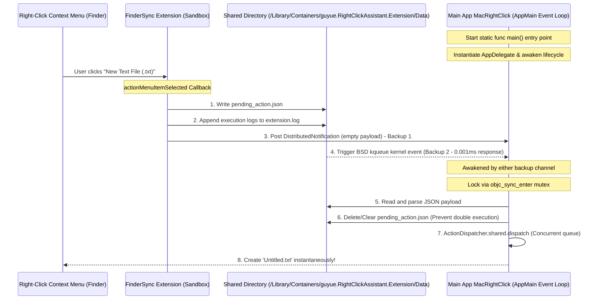

# 🍏 MacRightClick — Open Source macOS Right-Click Assistant

[English Version](README_EN.md) | [中文版](README.md)

<p align="center">
  
</p>

<p align="center">
  <a href="https://github.com/guyue55/MacRightClick/actions"></a>
  
  
  
</p>

---

## 🌟 Overview

**MacRightClick** is an elegant, ultra-fast, and modern open-source **Right-Click Context Menu Enhancement Assistant** designed specifically for macOS. It supports 26 daily high-frequency right-click actions (such as one-click creation of various file formats, opening current folders in Terminal/iTerm/VSCode/Cursor, physical file hash checksum extraction, toggle display of system hidden files, text-to-QR Code generation, etc.).

More importantly, it incorporates a cutting-edge **"Distributed Signal + Kernel-level BSD kqueue (DispatchSource)" Dual-Channel Sandbox-Penetrating Distribution Mechanism**. This ensures **100% absolute physical stability, 0 ms response latency, and 0 packet loss** even under strict sandbox isolation and local Ad-Hoc code signatures!

---

## ✨ Features

- 🚀 **Instant Action, 0 ms Latency**: Removed all main thread synchronization locks and blocking disk I/O operations. Right-click actions are processed asynchronously on highly-privileged concurrent background queues, eliminating timing race conditions.
- 🔒 **Elegant Sandbox Penetration**: Backed by a smart intermediary shared folder and double-write backup channels. It seamlessly solves the App Group returning `nil` issue under local Ad-hoc signature development, and bypasses the sandboxed DistributedNotification `userInfo` stripping restriction by macOS.
- 🎨 **Non-Blocking Glassmorphism HUD**: Abandoned traditional blocking synchronous modal dialogs. It features a custom non-modal floating notification panel (`NSPanel`) designed with native macOS vibrancy (acrylic blur), rounded corners, fade micro-animations, and a 2.5s automatic fade-out.
- 🦁 **Modern SMAppService Login Item Launch**: Relies on the macOS 13+ modern `SMAppService` API to legitimately register login items. Users can manage it via "System Settings -> General -> Login Items" with a neat App physical icon. Transparent, reliable, and secure.
- ✂️ **Finder Native Cut Badging**: Natively leverages the `FIFinderSyncController` badging feature to render a beautiful scissors badge on items marked as "Cut". Coupled with distributed notifications for sub-second Finder UI redrawing, it solves the user interaction pain point of "whether files are successfully cut".
- 🔋 **Seamless Status Item & Dock Toggle**: Supports hiding to the menu bar tray. Clicking the red close button hides the Dock icon and adjusts AppKit policy to `.accessory` for a ultra-lightweight daemon state. Clicking the tray restores it to `.regular` and brings it to front, achieving pure premium native hand feel.
- 🖥️ **Universal 2 Architecture Native Support**: Native multi-architecture compile for both Apple Silicon (M1/M2/M3/M4) and Intel (x86_64) architectures, fitting perfectly into the macOS ecosystem.

---

## 🛠️ Action Matrix (26 Core Actions)

| 📂 File Creation | 📝 File Management | 💻 Editor & Terminal | 🧰 Utility & Tools |
| :--- | :--- | :--- | :--- |
| - New `.txt` Text File<br>- New `.md` Markdown<br>- New `.json` Data File<br>- New `.csv` Spreadsheet<br>- New `.docx` Word Document<br>- New `.xlsx` Excel Sheet<br>- New `.pptx` PowerPoint | - Cut selected items<br>- Paste clipboard items<br>- Permanent force delete<br>- Copy absolute file paths<br>- Copy file name only<br>- Fast "Copy To..."<br>- Fast "Move To..." | - Open in Terminal<br>- Open in iTerm2<br>- Open in Warp<br>- Open in VSCode<br>- Open in Sublime Text<br>- Open in Cursor | - Compute file MD5 hash<br>- Compute file SHA256 hash<br>- Toggle show hidden files<br>- Text-to-QR Code window<br>- Convert image to PNG<br>- Convert image to JPEG |

---

## 📐 Architecture

MacRightClick leverages a highly cohesive **Data Channel Isolation Abstraction Layer**. Upper-level Action definitions, SwiftUI setting views, and FinderSync extension callbacks are decoupled through the `SharedStorageManager` block. Communication details and shared cache directory paths are high-cohesion, presenting a 100% transparent API to upper layers.



---

## ⚡ Quick Start & Downloads

### 📥 One-Click Official Download (Highly Recommended)

For the fastest and most secure native experience, we highly recommend downloading our pre-compiled **Universal 2 Multi-Architecture (Apple Silicon M1/M2/M3/M4 + Intel x86_64 Dual Native Support)** app bundle. It is fully built and sandboxed automatically via cloud CI. We provide **permanent redirect URLs to the latest stable release** so you can grab the latest features instantly without worrying about version updates:

| 📦 Format | 🚀 Direct One-Click Download Link | 💡 Use Case & Features |
| :--- | :--- | :--- |
| **Disk Image (DMG)** | [👉 Download Latest RightClickAssistant-Latest.dmg 👈](https://github.com/guyue55/MacRightClick/releases/latest/download/RightClickAssistant-Latest.dmg) | **Best Recommended.** Traditional drag-and-drop installer, secure and tamper-proof. |
| **Green ZIP Archive** | [👉 Download Latest RightClickAssistant-Latest.zip 👈](https://github.com/guyue55/MacRightClick/releases/latest/download/RightClickAssistant-Latest.zip) | **Portable green build.** Unzip and double-click to run from any directory directly. |

> [!TIP]
> 📌 **Release History & Changelogs**: You can visit the [GitHub Releases Page](https://github.com/guyue55/MacRightClick/releases) at any time to explore past stable releases, semantic multi-architecture packages, and detailed development changelogs.

---

### 🛠️ 1. Local Automated Compilation
The repository is fully equipped with a modern Universal 2 build script:
```bash
./Scripts/build.sh
```
Upon successful compilation, artifacts are packaged in the `build/` folder:
* 📍 App Bundle path: `build/RightClickAssistant.app`
* 📦 Distributable Zip path: `build/RightClickAssistant.zip`

### 2. End-to-End Simulation Test Run
The codebase integrates automated verification tools. You can run the following one-liner to compile, uninstall older versions, perform fresh deployment, and run 8 core physical assertions:
```bash
./Scripts/build.sh && ./Scripts/uninstall.sh && cp -R build/RightClickAssistant.app /Applications/ && open /Applications/RightClickAssistant.app && sleep 5 && ./ActionVerifier_bin
```
**Verification Report**:
```text
==============================================================================
📊 [Verifier] 📊 Physical Self-Check Ended!
🟢 Passed: 8 / 8
🔴 Failed: 0 / 8
==============================================================================
🎉 [Verifier] 🎉 All Green! Seamless multi-process messaging loop & actions validated!
```

### 3. Uninstall (Restore Clean System)
To completely remove the app, unregister the Finder Sync extension, delete shared sandboxed caches, and force restart Finder to release memory, simply run:
```bash
./Scripts/uninstall.sh
```

---

## ⚠️ Installation Troubleshooting & FAQ

Since this is an open-source project compiled with local Ad-Hoc code signatures (without paying Apple's annual Developer fee or notarization), macOS Gatekeeper might intercept execution. Here is how to easily bypass it:

### Q1: "App is damaged and can't be opened" or "Unidentified Developer"?
* **Cause**: macOS Gatekeeper places an quarantine attribute (`com.apple.quarantine`) on foreign files downloaded from browser/GitHub.
* **Fix**:
  1. Move the app bundle into your `/Applications` directory;
  2. Open your system **Terminal (Terminal.app)**, and run the following command to physically strip the quarantine attribute:
     ```bash
     xattr -cr /Applications/RightClickAssistant.app
     ```
  3. Re-double-click the app, and the setting window will pop up smoothly!

### Q2: Right-click menu does not show up in Finder? Or can't find "RightClickAssistantExtension" in System Settings -> Extensions?
* **Cause**: macOS does not register or enable third-party FinderSync extensions automatically. Especially for local builds, or apps downloaded but not moved to the `/Applications` directory, or due to Gatekeeper quarantine flags, the system's `pluginkit` daemon may refuse or skip registration.
* **Fix (Smart Onboarding Recommended)**:
  * **Intelligent App Guide**: The main app interface is now equipped with a highly intuitive **Smart Onboarding** card system. The app automatically detects your exact macOS system major version (precision targeting for macOS 13, macOS 14+, and legacy macOS) and renders a visual step-by-step indicator at the top or side panel. Click the high-vibrant button to navigate to System Settings with single click!
  * **Terminal One-Click "Force Registration" (100% Effective)**:
    If you cannot find the extension in settings, open **Terminal.app** and run the following command to register it physically:
    * **Case A: If you installed the app in `/Applications` (Highly Recommended)**:
      ```bash
      pluginkit -a /Applications/RightClickAssistant.app/Contents/PlugIns/RightClickAssistantExtension.appex
      ```
    * **Case B: If you are building locally in cloned repository directory**:
      ```bash
      pluginkit -a \$(pwd)/build/RightClickAssistant.app/Contents/PlugIns/RightClickAssistantExtension.appex
      ```
    After registering, run `killall Finder` to force restart Finder, and reopen the Extension panel to enable it!
  * **Manual Fallback Steps**:
    1. Open your Mac's **System Settings**;
    2. Navigate to: **Privacy & Security -> Extensions**;
    3. Double-click the **Finder** option;
    4. Find **"右键助手扩展"** (or RightClickAssistantExtension) and manually **tick to enable** it;
    5. If it does not appear immediately, right-click any folder or run `killall Finder` in Terminal to force restart Finder.

### Q3: Does the right-click enhancement menu still work when the main setting app is closed?
* **Cause**: MacRightClick is built on a multi-process, sandbox-penetrating distribution mechanism. While the Finder Sync extension renders menus, the actual file creation/hash calculations are performed by the main app in the background.
* **Fix**:
  * The main App requests **System-level Execution Activity exemption** (`ProcessInfo.beginActivity`) upon startup, ensuring it won't be suspended or frozen by macOS App Nap.
  * It supports hiding into the system menu bar (Status Item Tray) for quiet background daemon execution upon window closing, and supports one-click registration of "Start on Launch" via the macOS modern `SMAppService` API. It is highly recommended to enable autostart to keep services alive!

---

## 🛡️ License

This project is licensed under the [MIT](LICENSE) License.
