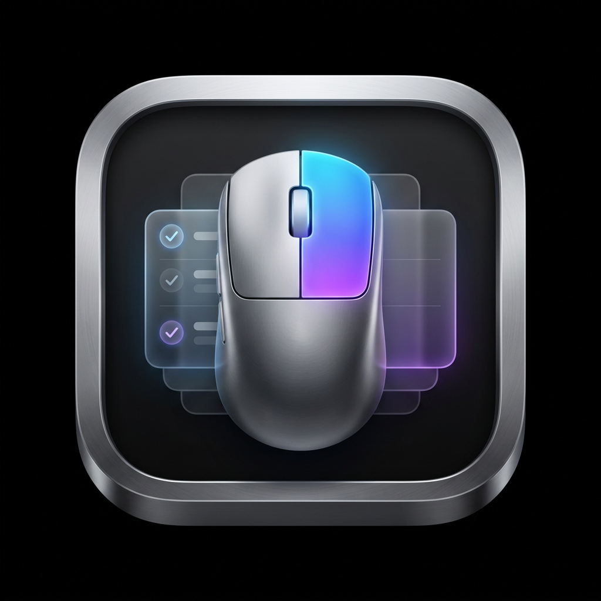
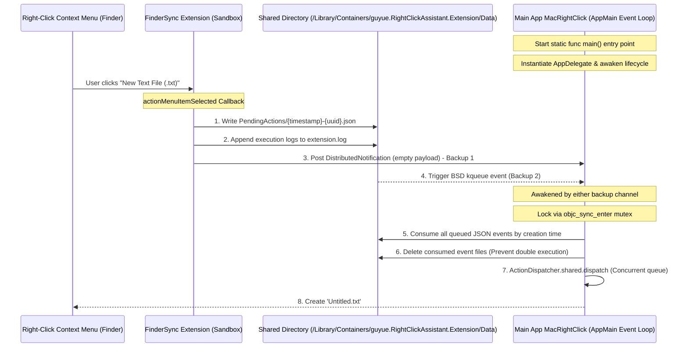

# 🍏 MacRightClick — Open Source macOS Right-Click Assistant

[English Version](README_EN.md) | [中文版](README.md)

<p align="center">
  
</p>

<p align="center">
  <a href="https://github.com/guyue55/MacRightClick/actions"></a>
  
  
  
</p>

---

## 🌟 Overview

**MacRightClick** is a free and open-source **Right-Click Context Menu Enhancement Assistant** for macOS. It supports 28 daily right-click actions, including creating common document formats, opening folders in terminals or editors, extracting file hashes, generating QR codes, and converting images.

The app uses a **Distributed Signal + BSD kqueue (DispatchSource)** queue-based dispatch mechanism that fits FinderSync extensions, website distribution, and local development builds.

---

## ✨ Features

- 🚀 **Queued Action Dispatch**: Every click writes an independent UUID event file that the host app consumes in order, avoiding overwrite problems from a single pending file.
- 🔒 **Clear Shared Channel**: The current website distribution route uses the extension sandbox intermediary directory so Ad-hoc and Developer ID builds share the same path behavior. Queue-based action files plus dual wake-up signals avoid sandboxed DistributedNotification `userInfo` stripping. A future Mac App Store route should switch to formal App Groups and security-scoped access.
- 🎨 **Non-Blocking Glassmorphism HUD**: Abandoned traditional blocking synchronous modal dialogs. It features a custom non-modal floating notification panel (`NSPanel`) designed with native macOS vibrancy (acrylic blur), rounded corners, fade micro-animations, and a 2.5s automatic fade-out.
- 🦁 **Modern SMAppService Login Item Launch**: Uses the macOS 13+ `SMAppService` API to register login items. Users can manage it in "System Settings -> General -> Login Items".
- ✂️ **Finder Native Cut Badging**: Natively leverages the `FIFinderSyncController` badging feature to render a beautiful scissors badge on items marked as "Cut". Coupled with distributed notifications for sub-second Finder UI redrawing, it solves the user interaction pain point of "whether files are successfully cut".
- 🔋 **Status Item & Dock Toggle**: Supports hiding to the menu bar. Closing the settings window hides the Dock icon and adjusts AppKit policy to `.accessory`; opening settings restores the regular app window.
- 🖥️ **Universal 2 Architecture Support**: Multi-architecture builds for both Apple Silicon (M1/M2/M3/M4) and Intel (x86_64).

---

## 🛠️ Action Matrix (28 Core Actions)

| 📂 File Creation | 📝 File Management | 💻 Editor & Terminal | 🧰 Utility & Tools |
| :--- | :--- | :--- | :--- |
| - New `.txt` Text File<br>- New `.md` Markdown<br>- New `.json` Data File<br>- New `.csv` Spreadsheet<br>- New `.html` Web Page<br>- New `.docx` Word Document<br>- New `.xlsx` Excel Sheet<br>- New `.pptx` PowerPoint<br>- New `.pdf` PDF Document | - Cut selected items<br>- Paste clipboard items<br>- Permanent delete (Advanced, off by default)<br>- Copy absolute file paths<br>- Copy file name only<br>- Copy To... (Advanced, off by default)<br>- Move To... (Advanced, off by default) | - Open in Terminal<br>- Open in iTerm2<br>- Open in Warp<br>- Open in VSCode<br>- Open in Sublime Text<br>- Open in Cursor | - Compute file MD5 hash<br>- Compute file SHA256 hash<br>- Toggle show hidden files (Advanced, off by default)<br>- Generate QR Code from clipboard<br>- Convert image to PNG<br>- Convert image to JPEG |

---

## 📐 Architecture

MacRightClick uses a centralized **Data Channel Isolation Abstraction Layer**. Action definitions, SwiftUI settings, and FinderSync callbacks share `SharedStorageManager`, which owns queued events, configuration files, and shared logs.



---

## ⚡ Quick Start & Downloads

### 📥 Official Download

Download the pre-compiled **Universal 2 Multi-Architecture (Apple Silicon + Intel x86_64)** app bundle. Release builds should use Developer ID signing, Hardened Runtime, Apple notarization, and stapled tickets; local development builds can still use Ad-hoc signing for quick iteration.

| 📦 Format | 🚀 Direct One-Click Download Link | 💡 Use Case & Features |
| :--- | :--- | :--- |
| **Disk Image (DMG)** | [Download Latest RightClickAssistant-Latest.dmg](https://github.com/guyue55/MacRightClick/releases/latest/download/RightClickAssistant-Latest.dmg) | Recommended drag-and-drop installer. |
| **ZIP Archive** | [Download Latest RightClickAssistant-Latest.zip](https://github.com/guyue55/MacRightClick/releases/latest/download/RightClickAssistant-Latest.zip) | Useful for testing or temporary use. |

> [!TIP]
> 📌 **Release History & Changelogs**: You can visit the [GitHub Releases Page](https://github.com/guyue55/MacRightClick/releases) at any time to explore past stable releases, semantic multi-architecture packages, and detailed development changelogs.

---

### 🚢 Distribution Route

The current primary route is **website / GitHub Releases distribution**, not Mac App Store distribution. For release builds:
```bash
DISTRIBUTION_ROUTE=website-release \
DEVELOPER_ID_APPLICATION="Developer ID Application: Your Name (TEAMID)" \
NOTARY_PROFILE="your-notarytool-profile" \
./Scripts/build.sh
```

This route enables Developer ID signing, Hardened Runtime, notarytool submission, and `stapler staple` for both the `.app` bundle and `.dmg`.

Mac App Store is not the default route. If the project later targets the Mac App Store, start with the [Mac App Store Architecture Migration Guide](docs/distribution/mac-app-store-architecture.md), which covers App Sandbox, formal App Groups, security-scoped bookmarks, and review considerations.

### 🛠️ 1. Local Automated Compilation
The repository is fully equipped with a modern Universal 2 build script:
```bash
./Scripts/build.sh
```
Upon successful compilation, artifacts are packaged in the `build/` folder:
* 📍 App Bundle path: `build/RightClickAssistant.app`
* 📦 Distributable Zip path: `build/RightClickAssistant.zip`

### 2. Local Verification
The codebase integrates local verification tools. You can run the following command to compile, uninstall older versions, deploy a fresh build, and run core assertions:
```bash
./Scripts/build.sh && ./Scripts/uninstall.sh && cp -R build/RightClickAssistant.app /Applications/ && open /Applications/RightClickAssistant.app && sleep 5 && ./ActionVerifier_bin
```
**Verification Report**:
```text
==============================================================================
📊 [Verifier] 📊 Physical Self-Check Ended!
🟢 Passed: 10 / 10
🔴 Failed: 0 / 10
==============================================================================
✅ [Verifier] Verification passed: multi-process action queue, lifecycle, and core actions behave as expected.
```

### 3. Uninstall
To remove the app, unregister the Finder Sync extension, delete shared sandbox caches, and restart Finder to release extension sessions, run:
```bash
./Scripts/uninstall.sh
```

---

## ⚠️ Installation Troubleshooting & FAQ

Since this is an open-source project compiled with local Ad-Hoc code signatures (without paying Apple's annual Developer fee or notarization), macOS Gatekeeper might intercept execution. Here is how to easily bypass it:

### Q1: "App is damaged and can't be opened" or "Unidentified Developer"?
* **Cause**: macOS Gatekeeper places an quarantine attribute (`com.apple.quarantine`) on foreign files downloaded from browser/GitHub.
* **Fix**:
  1. Move the app bundle into your `/Applications` directory;
  2. Open your system **Terminal (Terminal.app)**, and run the following command to physically strip the quarantine attribute:
     ```bash
     xattr -cr /Applications/RightClickAssistant.app
     ```
  3. Double-click the app again.

### Q2: Right-click menu does not show up in Finder? Or can't find "RightClickAssistantExtension" in System Settings -> Extensions?
* **Cause**: macOS does not register or enable third-party FinderSync extensions automatically. Especially for local builds, or apps downloaded but not moved to the `/Applications` directory, or due to Gatekeeper quarantine flags, the system's `pluginkit` daemon may refuse or skip registration.
* **Fix**:
  * **App Guide**: The main app detects your macOS version and shows the matching extension enablement steps with a System Settings shortcut.
  * **Terminal Manual Registration**:
    If you cannot find the extension in settings, open **Terminal.app** and run the following command:
    * **Case A: If you installed the app in `/Applications`**:
      ```bash
      pluginkit -a /Applications/RightClickAssistant.app/Contents/PlugIns/RightClickAssistantExtension.appex
      ```
    * **Case B: If you are building locally in cloned repository directory**:
      ```bash
      pluginkit -a \$(pwd)/build/RightClickAssistant.app/Contents/PlugIns/RightClickAssistantExtension.appex
      ```
    After registering, run `killall Finder` to restart Finder, then reopen the Extension panel to enable it.
  * **Manual Fallback Steps**:
    1. Open your Mac's **System Settings**;
    2. Navigate to: **Privacy & Security -> Extensions**;
    3. Double-click the **Finder** option;
    4. Find **"右键助手扩展"** (or RightClickAssistantExtension) and manually **tick to enable** it;
    5. If it does not appear immediately, right-click any folder or run `killall Finder` in Terminal to restart Finder.

### Q3: Does the right-click enhancement menu still work when the main setting app is closed?
* **Cause**: MacRightClick is built on a multi-process, sandbox-penetrating distribution mechanism. While the Finder Sync extension renders menus, the actual file creation/hash calculations are performed by the main app in the background.
* **Fix**:
  * The main app requests an execution activity (`ProcessInfo.beginActivity`) at startup to reduce the chance of App Nap interrupting queue consumption.
  * It supports hiding into the menu bar when the settings window closes, and supports "Start on Launch" via the macOS `SMAppService` API.

### Privacy And Security

- The project contains no ads and does not actively collect or upload usage data.
- Detailed debug logging is off by default. When enabled, logs may include menu rendering, watched path, and action filtering details; use it only for troubleshooting.
- High-risk actions such as permanent deletion, cross-directory copy/move, and hidden-file toggling are off by default and require confirmation before execution.
- Website release builds should use Developer ID, Hardened Runtime, Apple notarization, and stapled tickets for both `.app` and `.dmg` artifacts.

---

## 🛡️ License

This project is licensed under the [MIT](LICENSE) License.
