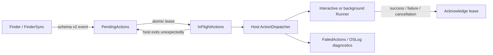

# MacRightClick

English | [简体中文](README.md)

<p align="center">
  
</p>

<p align="center">
  <a href="https://github.com/guyue55/MacRightClick/actions"></a>
  
  
  
</p>

MacRightClick is a free, open-source Finder context-menu assistant for macOS. The current source registers **30 actions**. Enabled actions that apply to the current selection appear directly in the top-level menu by default; a categorized submenu layout remains available.

A FinderSync extension renders menus and captures context, while the host app performs file operations, interaction, and background work. The app contains no ads, telemetry, or background update polling.

## Interface

| Finder top-level menu | Actions and profiles |
| :---: | :---: |
|  |  |

| Finder and permissions | Health diagnostics |
| :---: | :---: |
|  |  |

| Advanced and external tools | Dark mode |
| :---: | :---: |
|  |  |

## Highlights

- **30 built-in actions** for file creation, cut/paste, path copying, terminals/editors, hashes, QR codes, and image conversion.
- **Top-level menu by default** with favorites first and no oversized separator gap; categorized mode is optional.
- **Action profiles**: Essential, Professional, and Custom. Profiles never batch-enable advanced actions.
- **Fast filtering** by title, action ID, category, and status.
- **Everywhere or custom scope** covering common Finder roots and mounted volumes by default.
- **Layered health diagnostics** for menu service, Full Disk Access, and the action queue, with one prioritized repair action.
- **Reliable action queue** using Pending -> InFlight -> terminal acknowledgement and abandoned-lease recovery.
- **Explicit update checks** that run only after the user clicks Check for Updates.
- **Homebrew tool management** for iTerm2, Warp, VS Code, Sublime Text, and Cursor.
- **Universal 2** support for Apple Silicon and Intel Macs.

## 30 Actions

| Category | Count | Actions |
| --- | ---: | --- |
| New files | 9 | `.txt`, `.md`, `.json`, `.csv`, `.html`, `.docx`, `.xlsx`, `.pptx`, `.pdf` |
| File management | 9 | Cut, Paste, Permanent Delete, Copy Full Path, Copy Name, Copy To, Move To, Copy Shell-Safe Path, Copy Git-Relative Path |
| Terminals/editors | 6 | Terminal, iTerm2, Warp, Visual Studio Code, Sublime Text, Cursor |
| Utilities | 6 | MD5, SHA-256, Toggle Hidden Files, Clipboard Text to QR Code, Convert to PNG, Convert to JPEG |

> [!NOTE]
> Low-frequency professional actions are off by default. Permanent Delete, Copy To, Move To, and Toggle Hidden Files are advanced actions: they are off by default and require confirmation. Actions that depend on third-party apps are shown only when the corresponding app is installed.

## Architecture


```mermaid
flowchart LR
    F[Finder / FinderSync] -->|schema v2 event| P[PendingActions]
    P -->|atomic lease| I[InFlightActions]
    I --> H[Host ActionDispatcher]
    H --> R[Interactive or background Runner]
    R -->|success / failure / cancellation| A[Acknowledge lease]
    I -->|host exits unexpectedly| P
    H --> D[FailedActions / OSLog diagnostics]
```

- `DefaultActionRegistry` is the action source of truth for the host, FinderSync, settings, and tests.
- Finder menu rendering performs no network request, external process, or large-file work.
- The website distribution route exchanges configuration and events through the extension container while FinderSync remains sandboxed.
- Batch configuration changes use one atomic commit; FinderSync refreshes its in-process cache after notification.

### Permission Boundaries

**Full Disk Access does not determine whether the context menu appears.**

- Finder extension registration, enablement, and watch scope determine menu visibility.
- Full Disk Access affects file operations in some protected locations.
- After granting access, an existing process may retain its previous state. The app offers Relaunch App and Restart Finder when a refresh still reports the old state.

## Installation

> [!IMPORTANT]
> **Current downloads are free, open-source community builds.** They use an Ad-hoc signature, not a Developer ID from the paid Apple Developer Program, and they are not notarized by Apple. macOS may therefore report that it cannot verify the developer or block the first launch. This warning does not mean the file has been identified as malware, but it also means users cannot rely on an Apple-verified developer identity or notarization result. Installing through Homebrew does not change this status. Download only from this repository's Releases page and explicitly approve the app using the First Run steps below.

### GitHub Release

The code, GitHub Release, and Homebrew Cask are all at the **v1.2.0 community build**:

| Format | Current downloadable artifact |
| --- | --- |
| DMG | [RightClickAssistant-v1.2.0-macOS-Universal.dmg](https://github.com/guyue55/MacRightClick/releases/download/v1.2.0/RightClickAssistant-v1.2.0-macOS-Universal.dmg) |
| ZIP | [RightClickAssistant-v1.2.0-macOS-Universal.zip](https://github.com/guyue55/MacRightClick/releases/download/v1.2.0/RightClickAssistant-v1.2.0-macOS-Universal.zip) |

See [GitHub Releases](https://github.com/guyue55/MacRightClick/releases) for all versions.

### Updates And Latest

Every stable tag produces two asset classes:

- `RightClickAssistant-vX.Y.Z-macOS-Universal.*`: immutable versioned assets for Homebrew, rollback, and SHA-256 verification.
- `RightClickAssistant-Latest.*`: convenience aliases attached to the newest stable Release for manual downloads and simple scripts.

Stable Latest entry points:

```text
https://github.com/guyue55/MacRightClick/releases/latest
https://github.com/guyue55/MacRightClick/releases/latest/download/RightClickAssistant-Latest.dmg
https://github.com/guyue55/MacRightClick/releases/latest/download/RightClickAssistant-Latest.zip
```

> [!NOTE]
> Latest paths change when a new version is published and are unsuitable as reproducible installation sources. Homebrew does not use Latest assets. It discovers versions through `livecheck`, then uses a versioned URL and real SHA-256.

### Homebrew Cask

```bash
brew tap guyue55/macrightclick https://github.com/guyue55/MacRightClick.git
brew install --cask rightclickassistant
```

The current Cask is pinned to an immutable v1.2.0 URL with a real SHA-256. `brew upgrade` advances only after this repository updates the Cask version and checksum; it does not bypass version metadata by following a mutable Latest file.

> [!NOTE]
> Homebrew verifies the download SHA-256 and installs the app, but it cannot add a Developer ID signature or Apple notarization. The first launch may still require manual approval in Privacy & Security. Using `--no-quarantine` to bypass that user confirmation is not recommended.

```bash
brew update
brew upgrade --cask rightclickassistant
```

A normal uninstall keeps settings and runtime data:

```bash
brew uninstall --cask rightclickassistant
brew untap guyue55/macrightclick
```

To also remove settings, shared containers, and failed-action data, perform a full uninstall:

```bash
brew uninstall --cask --zap rightclickassistant
brew untap guyue55/macrightclick
```

> [!WARNING]
> `--zap` permanently removes user configuration and action-queue data.

For a local checkout, the current directory can be used as a local tap:

```bash
brew tap guyue55/macrightclick "$(pwd)"
brew install --cask rightclickassistant
```

## First Run

1. For a DMG, drag `RightClickAssistant.app` into `/Applications`. For a ZIP, extract it and move it there manually. Homebrew performs this step automatically.
2. Control-click the app in Finder, choose Open, and confirm again. If macOS still blocks it, open System Settings -> Privacy & Security and choose Open Anyway near the bottom of the page.
3. Use the precise `xattr` command in the FAQ only when the artifact is confirmed to come from this repository and the system UI cannot approve it. Never disable Gatekeeper globally.
4. Open the app, then register and enable the extension on the Finder page; open System Settings if needed.
5. Keep Watch Scope set to Everywhere, or choose Custom Directories and add folders.
6. Grant Full Disk Access only when protected-location operations require it.
7. Choose an action profile, favorites, and menu layout on the Actions page.

For a direct v1.2.0 DMG download, compare its SHA-256 with the value published in the Cask:

```bash
shasum -a 256 RightClickAssistant-v1.2.0-macOS-Universal.dmg
# Expected: fa71e4b80a4e1e4071ca6e6a5ee0af79ae2b48c74401c215ece2eea8aa8ad813
```

Manual extension registration:

```bash
pluginkit -a /Applications/RightClickAssistant.app/Contents/PlugIns/RightClickAssistantExtension.appex
pluginkit -e use -i guyue.RightClickAssistant.Extension
killall Finder
```

For a local build:

```bash
pluginkit -a "$(pwd)/build/RightClickAssistant.app/Contents/PlugIns/RightClickAssistantExtension.appex"
pluginkit -e use -i guyue.RightClickAssistant.Extension
killall Finder
```

## Build And Verification

Current community artifacts and local development builds both use an Ad-hoc signature:

```bash
./Scripts/build.sh
```

Artifacts:

- `build/RightClickAssistant.app`
- `build/RightClickAssistant.zip`
- `build/RightClickAssistant.dmg`
- `ActionVerifier_bin`

Core checks:

```bash
swift test
bash Tests/CaskStructureTests.sh
./Scripts/validate_cask.sh
./Scripts/build.sh
codesign --verify --deep --strict --verbose=2 build/RightClickAssistant.app
hdiutil verify build/RightClickAssistant.dmg
```

`ActionVerifier_bin` covers 10 key workflows; it does not claim to execute all 30 actions. Apply the Professional profile on the Actions page first:

```bash
./ActionVerifier_bin
```

Pushing a `vX.Y.Z` tag currently makes CI build and publish an Ad-hoc community release automatically. It creates versioned DMG/ZIP files, Latest DMG/ZIP aliases, `SHA256SUMS`, and `COMMUNITY_BUILD.txt`. Both the Release notes and Cask disclose the non-notarized status, and existing version assets cannot be replaced in place.

The repository also retains a future Developer ID distribution path, but the project currently has no paid Apple Developer Program credentials. It can be used manually only after signing and notarization credentials are configured:

```bash
DISTRIBUTION_ROUTE=website-release \
DEVELOPER_ID_APPLICATION="Developer ID Application: Your Name (TEAMID)" \
NOTARY_PROFILE="your-notarytool-profile" \
./Scripts/build.sh
```

Missing paid credentials do not block an explicitly labeled community release, but community artifacts must never be described as Apple verified, notarized, or formally distributed with a Developer ID.

## External Tools

Advanced -> External Tools checks these Homebrew locations:

```text
/opt/homebrew/bin/brew
/usr/local/bin/brew
```

The app runs `brew install --cask` or `brew upgrade --cask` in the background only after a user clicks Install or Update. If Homebrew is unavailable, the app only offers the official website and a copyable official install command; it does not execute a remote script automatically.

## Privacy And Logs

- No ads, telemetry, or background update polling.
- Update checking sends a request to the GitHub Latest Release API only after explicit user action.
- Verbose debug logging is off by default and may include menu-rendering or watched-path details when enabled.
- Logs use OSLog; the app no longer continuously appends `extension.log`.

```bash
log show --predicate 'subsystem == "guyue.RightClickAssistant"' --last 5m --info
```

The same predicate can be used in `Console.app`:

```text
subsystem == "guyue.RightClickAssistant"
```

## FAQ

### Full Disk Access is granted, but the app still reports it as unavailable

Return to the Finder page and click Recheck. If the state remains stale, use Relaunch App and Restart Finder. TCC state can require the relevant processes to restart before they observe a newly granted permission.

### The context menu is missing in other folders

On the Finder page, verify that the extension is enabled and Watch Scope is Everywhere. The Diagnostics page should show a recent heartbeat with at least one observed entry. Menu visibility and Full Disk Access are separate states.

### How do I clear failed actions?

Diagnostics shows pending, oldest-wait, and failed counts. After confirming that failed events are no longer needed, click Clear Failed Actions.

### Gatekeeper blocks a community release or local Ad-hoc build

Current GitHub Release and Cask artifacts are not notarized by Apple. First try Control-click -> Open, or System Settings -> Privacy & Security -> Open Anyway. Only after confirming that the app came from this repository, remove the quarantine attribute from this app alone:

```bash
xattr -dr com.apple.quarantine /Applications/RightClickAssistant.app
```

> [!WARNING]
> Do not run `sudo spctl --master-disable`, do not run `xattr` against the entire `/Applications` directory, and do not bypass quarantine for an app from an unknown source. This command removes only the download quarantine marker from the specified app; it does not sign or notarize it.

## Documentation

- [Changelog](CHANGELOG.md)
- [Mac App Store architecture migration](docs/distribution/mac-app-store-architecture.md)
- [v1.2 design](docs/superpowers/specs/2026-07-10-v1.2-native-experience-reliability-design.md)
- [v1.2 implementation plan](docs/superpowers/plans/2026-07-10-v1.2-native-experience-reliability.md)

## License

[MIT](LICENSE)
