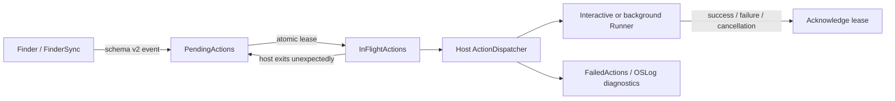

# MacRightClick

English | [简体中文](README.md)

<p align="center">
  
</p>

<p align="center">
  <a href="https://github.com/guyue55/MacRightClick/actions"></a>
  
  
  
</p>

MacRightClick is a free, open-source Finder context-menu assistant for macOS. The current source registers **30 actions**. Enabled actions that apply to the current selection appear directly in the top-level menu by default; a categorized submenu layout remains available.

A FinderSync extension renders menus and captures context, while the host app performs file operations, interaction, and background work. The app contains no ads, telemetry, or background update polling.

## Interface

| Finder top-level menu | Actions and profiles |
| :---: | :---: |
|  |  |

| Finder and permissions | Health diagnostics |
| :---: | :---: |
|  |  |

| Advanced and external tools | Dark mode |
| :---: | :---: |
|  |  |

## Highlights

- **30 built-in actions** for file creation, cut/paste, path copying, terminals/editors, hashes, QR codes, and image conversion.
- **Top-level menu by default** with favorites first and no oversized separator gap; categorized mode is optional.
- **Action profiles**: Essential, Professional, and Custom. Profiles never batch-enable advanced actions.
- **Fast filtering** by title, action ID, category, and status.
- **Everywhere or custom scope** covering common Finder roots and mounted volumes by default.
- **Layered health diagnostics** for menu service, Full Disk Access, and the action queue, with one prioritized repair action.
- **Reliable action queue** using Pending -> InFlight -> terminal acknowledgement and abandoned-lease recovery.
- **Explicit update checks** that run only after the user clicks Check for Updates.
- **Homebrew tool management** for iTerm2, Warp, VS Code, Sublime Text, and Cursor.
- **Universal 2** support for Apple Silicon and Intel Macs.

## 30 Actions

| Category | Count | Actions |
| --- | ---: | --- |
| New files | 9 | `.txt`, `.md`, `.json`, `.csv`, `.html`, `.docx`, `.xlsx`, `.pptx`, `.pdf` |
| File management | 9 | Cut, Paste, Permanent Delete, Copy Full Path, Copy Name, Copy To, Move To, Copy Shell-Safe Path, Copy Git-Relative Path |
| Terminals/editors | 6 | Terminal, iTerm2, Warp, Visual Studio Code, Sublime Text, Cursor |
| Utilities | 6 | MD5, SHA-256, Toggle Hidden Files, Clipboard Text to QR Code, Convert to PNG, Convert to JPEG |

> [!NOTE]
> Low-frequency professional actions are off by default. Permanent Delete, Copy To, Move To, and Toggle Hidden Files are advanced actions: they are off by default and require confirmation. Actions that depend on third-party apps are shown only when the corresponding app is installed.

## Architecture


```mermaid
flowchart LR
    F[Finder / FinderSync] -->|schema v2 event| P[PendingActions]
    P -->|atomic lease| I[InFlightActions]
    I --> H[Host ActionDispatcher]
    H --> R[Interactive or background Runner]
    R -->|success / failure / cancellation| A[Acknowledge lease]
    I -->|host exits unexpectedly| P
    H --> D[FailedActions / OSLog diagnostics]
```

- `DefaultActionRegistry` is the action source of truth for the host, FinderSync, settings, and tests.
- Finder menu rendering performs no network request, external process, or large-file work.
- The website distribution route exchanges configuration and events through the extension container while FinderSync remains sandboxed.
- Batch configuration changes use one atomic commit; FinderSync refreshes its in-process cache after notification.

### Permission Boundaries

**Full Disk Access does not determine whether the context menu appears.**

- Finder extension registration, enablement, and watch scope determine menu visibility.
- Full Disk Access affects file operations in some protected locations.
- After granting access, an existing process may retain its previous state. The app offers Relaunch App and Restart Finder when a refresh still reports the old state.

## Installation

### GitHub Release

The repository development version is **1.2.0**. Until a formal v1.2.0 tag is published, the online stable artifacts and Cask remain at **v1.1.1**:

| Format | Current stable artifact |
| --- | --- |
| DMG | [RightClickAssistant-v1.1.1-macOS-Universal.dmg](https://github.com/guyue55/MacRightClick/releases/download/v1.1.1/RightClickAssistant-v1.1.1-macOS-Universal.dmg) |
| ZIP | [RightClickAssistant-v1.1.1-macOS-Universal.zip](https://github.com/guyue55/MacRightClick/releases/download/v1.1.1/RightClickAssistant-v1.1.1-macOS-Universal.zip) |

See [GitHub Releases](https://github.com/guyue55/MacRightClick/releases) for all versions.

### Homebrew Cask

```bash
brew tap guyue55/macrightclick https://github.com/guyue55/MacRightClick.git
brew install --cask rightclickassistant
```

The current Cask is pinned to an immutable v1.1.1 URL with a real SHA-256. `brew upgrade` advances only after this repository updates the Cask version and checksum; it does not bypass version metadata by following a mutable Latest file.

```bash
brew update
brew upgrade --cask rightclickassistant
```

Uninstall:

```bash
brew uninstall --cask rightclickassistant
brew untap guyue55/macrightclick
```

For a local checkout, the current directory can be used as a local tap:

```bash
brew tap guyue55/macrightclick "$(pwd)"
brew install --cask rightclickassistant
```

## First Run

1. Put `RightClickAssistant.app` in `/Applications` and open it.
2. Register and enable the extension on the Finder page; open System Settings if needed.
3. Keep Watch Scope set to Everywhere, or choose Custom Directories and add folders.
4. Grant Full Disk Access only when protected-location operations require it.
5. Choose an action profile, favorites, and menu layout on the Actions page.

Manual extension registration:

```bash
pluginkit -a /Applications/RightClickAssistant.app/Contents/PlugIns/RightClickAssistantExtension.appex
pluginkit -e use -i guyue.RightClickAssistant.Extension
killall Finder
```

For a local build:

```bash
pluginkit -a "$(pwd)/build/RightClickAssistant.app/Contents/PlugIns/RightClickAssistantExtension.appex"
pluginkit -e use -i guyue.RightClickAssistant.Extension
killall Finder
```

## Build And Verification

Local development builds use an Ad-hoc signature:

```bash
./Scripts/build.sh
```

Artifacts:

- `build/RightClickAssistant.app`
- `build/RightClickAssistant.zip`
- `build/RightClickAssistant.dmg`
- `ActionVerifier_bin`

Core checks:

```bash
swift test
bash Tests/CaskStructureTests.sh
./Scripts/validate_cask.sh
./Scripts/build.sh
codesign --verify --deep --strict --verbose=2 build/RightClickAssistant.app
hdiutil verify build/RightClickAssistant.dmg
```

`ActionVerifier_bin` covers 10 key workflows; it does not claim to execute all 30 actions. Apply the Professional profile on the Actions page first:

```bash
./ActionVerifier_bin
```

Formal tag releases require Developer ID and notarization credentials:

```bash
DISTRIBUTION_ROUTE=website-release \
DEVELOPER_ID_APPLICATION="Developer ID Application: Your Name (TEAMID)" \
NOTARY_PROFILE="your-notarytool-profile" \
./Scripts/build.sh
```

The CI tag-release job fails when signing or notarization credentials are missing. It never falls back to publishing Ad-hoc artifacts as a formal release.

## External Tools

Advanced -> External Tools checks these Homebrew locations:

```text
/opt/homebrew/bin/brew
/usr/local/bin/brew
```

The app runs `brew install --cask` or `brew upgrade --cask` in the background only after a user clicks Install or Update. If Homebrew is unavailable, the app only offers the official website and a copyable official install command; it does not execute a remote script automatically.

## Privacy And Logs

- No ads, telemetry, or background update polling.
- Update checking sends a request to the GitHub Latest Release API only after explicit user action.
- Verbose debug logging is off by default and may include menu-rendering or watched-path details when enabled.
- Logs use OSLog; the app no longer continuously appends `extension.log`.

```bash
log show --predicate 'subsystem == "guyue.RightClickAssistant"' --last 5m --info
```

The same predicate can be used in `Console.app`:

```text
subsystem == "guyue.RightClickAssistant"
```

## FAQ

### Full Disk Access is granted, but the app still reports it as unavailable

Return to the Finder page and click Recheck. If the state remains stale, use Relaunch App and Restart Finder. TCC state can require the relevant processes to restart before they observe a newly granted permission.

### The context menu is missing in other folders

On the Finder page, verify that the extension is enabled and Watch Scope is Everywhere. The Diagnostics page should show a recent heartbeat with at least one observed entry. Menu visibility and Full Disk Access are separate states.

### How do I clear failed actions?

Diagnostics shows pending, oldest-wait, and failed counts. After confirming that failed events are no longer needed, click Clear Failed Actions.

### Gatekeeper blocks my local Ad-hoc build

Prefer a formally signed and notarized release. For a local build you created from trusted source, remove quarantine from that build only:

```bash
xattr -cr /Applications/RightClickAssistant.app
```

## Documentation

- [Changelog](CHANGELOG.md)
- [Mac App Store architecture migration](docs/distribution/mac-app-store-architecture.md)
- [v1.2 design](docs/superpowers/specs/2026-07-10-v1.2-native-experience-reliability-design.md)
- [v1.2 implementation plan](docs/superpowers/plans/2026-07-10-v1.2-native-experience-reliability.md)

## License

[MIT](LICENSE)
