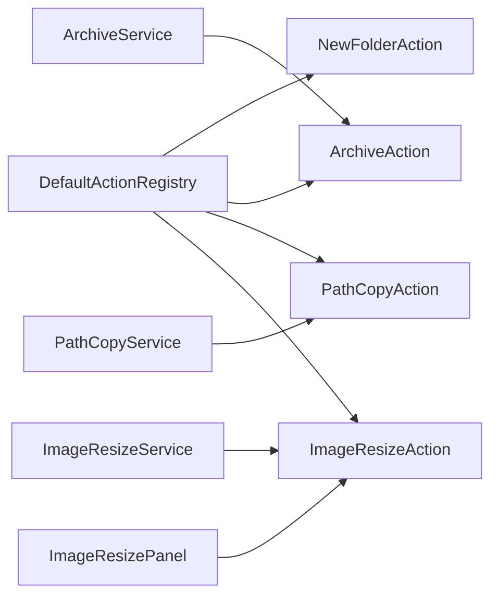

# 右键增强功能 Backlog 实施计划

> **For agentic workers:** REQUIRED SUB-SKILL: Use superpowers:subagent-driven-development (recommended) or superpowers:executing-plans to implement this plan task-by-task. Steps use checkbox (`- [ ]`) syntax for tracking.

**Goal:** Build the next high-value right-click action package: new folder, archive zip/unzip, shell/git path copy, and image resizing.

**Architecture:** Keep each feature isolated behind a small `MenuAction` shell and a pure service module. Use `BackgroundActionRunner` for long IO, `InteractiveActionRunner` for parameter prompts, and introduce `DefaultActionRegistry` so host and FinderSync register the same action list.

**Tech Stack:** Swift 6, AppKit FinderSync, SwiftUI settings, Foundation FileManager, NSImage/NSBitmapImageRep, Process for system zip/unzip only when safer than custom code.

**Delivery Policy:** Prefer small pull-request sized changes. Each milestone should be independently buildable and should not require enabling later milestones.

## Definition of Done

- [ ] New behavior has focused unit tests where the logic is not Finder-only.
- [ ] New source files are included in `Scripts/build.sh`.
- [ ] Action defaults are intentional and documented.
- [ ] Long-running work does not run on FinderSync's main path.
- [ ] User-facing failure text is concise; diagnostic detail goes to OSLog.
- [ ] `./Scripts/build.sh` passes before release packaging.

## Dependency Map

---

## Milestone 0: Registration Hygiene

**Estimate:** S

**Depends on:** None

### Task 0.1: Introduce DefaultActionRegistry

**Files:**
- Create: `Sources/RightClickAssistant/Core/DefaultActionRegistry.swift`
- Modify: `Sources/RightClickAssistant/AppDelegate.swift`
- Modify: `Sources/RightClickAssistantExtension/FinderSync.swift`
- Modify: `Scripts/build.sh`
- Test: `Tests/RightClickAssistantTests.swift`

- [ ] Write failing test `testDefaultActionRegistryRegistersExpectedCoreActions`.
- [ ] Implement `DefaultActionRegistry.registerAll(into:)`.
- [ ] Replace duplicated registration blocks in host and extension.
- [ ] Add the new source file to both `HOST_SOURCES` and `EXT_SOURCES`.
- [ ] Run `swift test --filter RightClickAssistantTests` in a healthy SwiftPM environment.
- [ ] Run `./Scripts/build.sh`.

**Acceptance Criteria**

- Host and extension register through the same function.
- Existing 28 actions still exist.
- Adding a new action requires one registration change.

## Milestone 1: New Folder

**Estimate:** S

**Depends on:** Milestone 0

### Task 1.1: Add NewFolderAction

**Files:**
- Create: `Sources/RightClickAssistant/Core/Actions/NewFolderAction.swift`
- Modify: `Sources/RightClickAssistant/Core/DefaultActionRegistry.swift`
- Modify: `Scripts/build.sh`
- Test: `Tests/RightClickAssistantTests.swift`

- [ ] Write failing test for creating `新建文件夹` in an empty directory.
- [ ] Write failing test for conflict naming: `新建文件夹 1`.
- [ ] Write failing test for file target: creates in parent directory.
- [ ] Implement destination inference with the same semantics as `NewFileAction`.
- [ ] Register action in `DefaultActionRegistry`.
- [ ] Add source file to build script.
- [ ] Run targeted tests and build script.

**Acceptance Criteria**

- Action ID: `guyue.action.newfolder`.
- Title: `新建文件夹`.
- Category: `.newFile`.
- Default enabled.
- Available for item and container contexts.
- Creates folder, auto-renames on conflict, highlights in Finder, shows HUD.

## Milestone 2: Archive Actions

**Estimate:** M

**Depends on:** Milestone 0

### Task 2.1: Add ArchiveService

**Files:**
- Create: `Sources/RightClickAssistant/Core/Actions/ArchiveService.swift`
- Test: `Tests/RightClickAssistantTests.swift`

- [ ] Write failing test for output zip name from one selected item.
- [ ] Write failing test for `归档.zip` when multiple items are selected.
- [ ] Write failing test for conflict naming.
- [ ] Write failing test for Zip Slip path validation.
- [ ] Implement service functions:
  - `zip(targets:destinationDirectory:)`
  - `unzip(zipURL:)`
  - `uniqueURL(baseName:extension:in:)`
  - `isSafeArchiveEntry(_:inside:)`

**Acceptance Criteria**

- Service contains no AppKit UI code.
- Never overwrites existing output.
- Rejects unsafe unzip paths escaping the target directory.

### Task 2.2: Add ArchiveAction

**Files:**
- Create: `Sources/RightClickAssistant/Core/Actions/ArchiveAction.swift`
- Modify: `Sources/RightClickAssistant/Core/DefaultActionRegistry.swift`
- Modify: `Scripts/build.sh`
- Test: `Tests/RightClickAssistantTests.swift`

- [ ] Write failing availability tests:
  - `zip` shows for any existing selected file/folder.
  - `unzip` shows only for `.zip` files.
- [ ] Implement `ArchiveAction(type: .zip/.unzip)`.
- [ ] Route work through a private `BackgroundActionRunner`.
- [ ] Register both actions.
- [ ] Run build script.

**Acceptance Criteria**

- `压缩为 ZIP` default enabled.
- `解压到同名文件夹` default enabled.
- Long IO does not block PendingAction consumption.
- Success and failure HUDs summarize item counts.

## Milestone 3: Path Copy Actions

**Estimate:** S

**Depends on:** Milestone 0

### Task 3.1: Add PathCopyService

**Files:**
- Create: `Sources/RightClickAssistant/Core/Actions/PathCopyService.swift`
- Test: `Tests/RightClickAssistantTests.swift`

- [ ] Write failing tests for shell escaping:
  - spaces
  - single quotes
  - parentheses
- [ ] Write failing tests for Git root lookup using a temporary `.git` directory.
- [ ] Implement:
  - `shellEscapedPath(_:)`
  - `gitRoot(containing:)`
  - `relativePath(_:from:)`

**Acceptance Criteria**

- Shell output can be pasted into zsh safely.
- Git relative path returns `nil` outside a repository.

### Task 3.2: Add PathCopyAction

**Files:**
- Create: `Sources/RightClickAssistant/Core/Actions/PathCopyAction.swift`
- Modify: `Sources/RightClickAssistant/Core/DefaultActionRegistry.swift`
- Modify: `Scripts/build.sh`
- Test: `Tests/RightClickAssistantTests.swift`

- [ ] Write failing availability tests for Git relative action.
- [ ] Implement clipboard writing for one or many selected items.
- [ ] Register:
  - `复制 Shell 转义路径`
  - `复制 Git 相对路径`

**Acceptance Criteria**

- Shell escaped path default enabled.
- Git relative path default disabled.
- Multi-select writes one path per line.

## Milestone 4: Image Resize

**Estimate:** M

**Depends on:** Milestone 0

### Task 4.1: Add ImageResizeService

**Files:**
- Create: `Sources/RightClickAssistant/Core/Actions/ImageResizeService.swift`
- Test: `Tests/RightClickAssistantTests.swift`

- [ ] Write failing test for aspect-ratio preserving resize.
- [ ] Write failing test for output naming: `name-1024w.jpg`.
- [ ] Write failing test for conflict naming.
- [ ] Implement resize through `NSImage` and `NSBitmapImageRep`.

**Acceptance Criteria**

- Supports PNG and JPEG output at minimum.
- Keeps aspect ratio.
- Never overwrites.

### Task 4.2: Add ImageResizePanel

**Files:**
- Create: `Sources/RightClickAssistant/Core/Actions/ImageResizePanel.swift`

- [ ] Build a compact `NSPanel` with width choices: `640`, `1024`, `1440`, custom.
- [ ] Return a `ResizeRequest(width: Int)` to the caller.
- [ ] Keep all UI on main thread.

**Acceptance Criteria**

- Panel is non-surprising and modal enough to collect one number.
- Invalid custom width is rejected before action starts.

### Task 4.3: Add ImageResizeAction

**Files:**
- Create: `Sources/RightClickAssistant/Core/Actions/ImageResizeAction.swift`
- Modify: `Sources/RightClickAssistant/Core/DefaultActionRegistry.swift`
- Modify: `Scripts/build.sh`
- Test: `Tests/RightClickAssistantTests.swift`

- [ ] Write failing availability tests for image-only selection.
- [ ] Use `InteractiveActionRunner` for panel plus background IO.
- [ ] Register `缩放图片到指定宽度`.

**Acceptance Criteria**

- Default disabled.
- Only appears for supported image files.
- Batch results are summarized in HUD.

## Milestone 5: Settings and Documentation

**Estimate:** S

**Depends on:** Any shipped action milestone

### Task 5.1: Update Settings Copy

**Files:**
- Modify: `Sources/RightClickAssistant/Views/ContentView.swift`

- [ ] Confirm new actions show in existing Action settings groups.
- [ ] Ensure advanced/default-off wording still makes sense.
- [ ] No new top-level settings page unless image resizing needs persistent presets.

### Task 5.2: Update README and Changelog

**Files:**
- Modify: `README.md`
- Modify: `README_EN.md`
- Modify: `CHANGELOG.md`

- [ ] Add v1.1 action list.
- [ ] Document zip/unzip behavior and no-overwrite policy.
- [ ] Document image resize limitations.

## Cross-Cutting Test Matrix

- [ ] `swift test --filter RightClickAssistantTests`
- [ ] `swift test --filter BackgroundActionRunnerTests`
- [ ] `swift test --filter InteractiveActionRunnerTests`
- [ ] `./Scripts/build.sh`
- [ ] Manual Finder test: new folder from blank area.
- [ ] Manual Finder test: zip multiple selected files.
- [ ] Manual Finder test: unzip zip into same-name folder.
- [ ] Manual Finder test: copy shell escaped path and paste into Terminal.
- [ ] Manual Finder test: resize three screenshots to 1024px width.

## Backlog Priority

### P0

- DefaultActionRegistry.
- NewFolderAction.
- ArchiveService + ArchiveAction.

### P1

- PathCopyService + PathCopyAction.
- ImageResizeService.

### P2

- ImageResizePanel + ImageResizeAction.
- README / changelog updates.

### Deferred

- Batch rename with preview.
- Custom folder templates.
- File locksmith via `lsof`.
- Duplicate file finder.
- Disk analyzer.
- App uninstaller.

## Risk Register

- **Zip Slip:** unzip must validate every entry before writing.
- **Large archives:** archive actions must run off the pending queue.
- **Image memory:** very large images can spike memory; batch processing should be sequential.
- **Git root lookup:** symlink and worktree edge cases should be handled conservatively.
- **Menu crowding:** new default-enabled actions must stay few; default-off for niche actions.

## Release Slices

### Slice A: Fast Utility Release

- DefaultActionRegistry.
- NewFolderAction.
- Shell escaped path.

This slice is low risk and can ship quickly if archive work takes longer.

### Slice B: File Operation Release

- ArchiveService.
- Zip action.
- Unzip action.

This slice should receive extra manual Finder testing with large folders and invalid archives.

### Slice C: Media Utility Release

- ImageResizeService.
- ImageResizePanel.
- ImageResizeAction.

This slice can ship after basic file actions are stable because it introduces user input UI and image memory concerns.

## Review Checklist

- [ ] Does each new Action have exactly one reason to change?
- [ ] Can every Service be tested without launching Finder?
- [ ] Are all output URLs generated through one no-overwrite helper?
- [ ] Are default-enabled actions truly high-frequency?
- [ ] Does flat mode remain usable without separators becoming noisy?
- [ ] Is every new action safe when multiple files are selected?

## Execution Recommendation

Implement in this order:

1. DefaultActionRegistry
2. NewFolderAction
3. ArchiveService/ArchiveAction
4. PathCopyService/PathCopyAction
5. ImageResizeService
6. ImageResizePanel/ImageResizeAction

This order gives user-visible value early while keeping risk contained.
