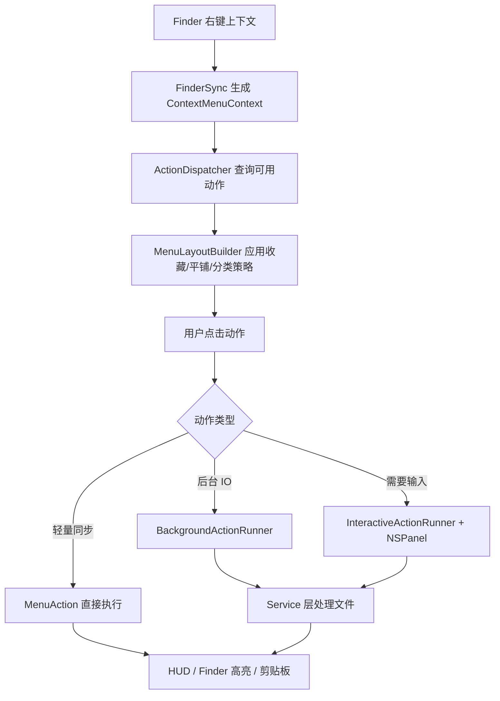

# 右键增强功能路线设计方案

## 背景

MacRightClick 当前已经具备 28 个核心动作：新建常见文件、剪切/粘贴、路径复制、复制/移动到、终端/编辑器打开、哈希、二维码、图片 PNG/JPEG 转换等。下一阶段应该继续围绕 Finder 右键的“低打扰、高频效率”扩展，而不是膨胀成完整文件管理器。

外部调研结论：

- Microsoft PowerToys New+ 支持从文件资源管理器右键直接用模板创建文件和文件夹，证明“新建模板化项目”是成熟方向：https://learn.microsoft.com/en-us/windows/powertoys/newplus
- PowerToys Image Resizer 是右键批量图片处理的典型场景：https://learn.microsoft.com/en-us/windows/powertoys/image-resizer
- PowerToys PowerRename 证明批量重命名高价值，但需要预览与撤销设计，适合后续独立阶段：https://learn.microsoft.com/en-us/windows/powertoys/powerrename
- Apple Finder Sync 官方定位是安全修改 Finder UI、添加右键菜单和徽标，适合承载轻量动作，不适合长时间阻塞或复杂常驻任务：https://developer.apple.com/library/archive/documentation/General/Conceptual/ExtensibilityPG/Finder.html
- macOS 同类 New File Menu 主打 Finder 右键新建文件和 30+ 模板；iBoysoft MagicMenu 覆盖新建、复制/移动、压缩、图片转换、重复文件、磁盘分析等，证明本项目下一阶段功能方向有市场验证：https://apps.apple.com/us/app/new-file-menu/id1064959555 与 https://apps.apple.com/us/app/iboysoft-magicmenu/id1599191594

## 产品原则

1. **右键菜单只放高频动作**：动作必须能在 1-2 次点击内完成，或打开一个明确的轻量面板。
2. **默认菜单保持克制**：低风险、高频动作默认启用；批量、覆盖、破坏性动作默认关闭或二次确认。
3. **每类能力独立模块化**：新建、压缩、图片、路径复制分别由独立 Action 与 Service 负责，不把逻辑塞进 `FileManageAction`。
4. **长任务不阻塞 FinderSync 或 PendingAction 队列**：压缩、解压、图片缩放走 `BackgroundActionRunner`；需要用户输入的动作走 `InteractiveActionRunner`。
5. **所有文件写入都不覆盖**：默认自动重名；涉及覆盖必须明确确认。
6. **优先站外分发路线**：保持 website-dev / website-release 行为稳定，不提前引入 MAS 沙盒约束。

## 推荐功能包：v1.1 高频效率动作

### 1. 新建文件夹

定位：最低成本、最高频的基础能力。

行为：

- 右键空白处：在当前目录创建 `新建文件夹`。
- 右键文件夹：在该文件夹内创建。
- 右键文件：在文件所在目录创建。
- 重名自动递增为 `新建文件夹 1`、`新建文件夹 2`。
- 创建后 Finder 高亮新文件夹并显示 HUD。

默认状态：启用。

风险：低。

### 2. 压缩为 ZIP

定位：补齐 Finder 常见压缩能力，但提供更稳定的命名和反馈。

行为：

- 选中一个文件/文件夹：生成 `<名称>.zip`。
- 选中多个项目：生成 `归档.zip`，重名自动递增。
- 输出位置为选中项所在目录。
- 后台执行，成功后 Finder 高亮 zip，失败 HUD 提示。

默认状态：启用。

风险：中低。大文件耗时，需要后台队列和进度/完成反馈。

### 3. 解压到同名文件夹

定位：比双击 zip 更可控，避免把大量文件直接散落到当前目录。

行为：

- 仅对 `.zip` 文件显示。
- 单个 zip：解压到同名文件夹，如 `Archive.zip` -> `Archive/`。
- 多个 zip：每个 zip 解压到各自同名文件夹。
- 目标文件夹重名自动递增。
- 后台执行，失败不删除源 zip。

默认状态：启用。

风险：中。需要防 Zip Slip 路径穿越，确保解压条目不写出目标目录。

### 4. 图片缩放到指定宽度

定位：面向博客、开发、产品文档、截图处理。

行为：

- 仅对图片文件显示。
- 提供轻量面板选择宽度：`640 / 1024 / 1440 / 自定义`。
- 保持宽高比。
- 输出文件命名：`原名-1024w.ext`。
- 默认不覆盖；重名自动递增。

默认状态：关闭。用户按需开启，避免菜单过长。

风险：中。需要处理批量图片、超大图内存、GIF 多帧降级说明。

### 5. 复制 Shell 转义路径 / Git 相对路径

定位：开发者效率增强。

行为：

- 复制 Shell 转义路径：将路径按 shell 安全格式复制到剪贴板，空格、引号、特殊字符可直接粘贴到终端。
- 复制 Git 相对路径：从选中项向上查找 `.git`，复制相对仓库根目录路径；不在 Git 仓库内则不显示。
- 多选时每行一个路径。

默认状态：

- Shell 转义路径：启用。
- Git 相对路径：关闭，开发者按需开启。

风险：低。核心是路径字符串处理和 Git 根目录查找。

## 延后功能池

### 批量重命名

高价值，但必须有预览、冲突检测、撤销策略。建议 v1.2 单独设计，不和 v1.1 混做。

### 自定义模板文件/文件夹

价值高，但涉及模板目录、设置页管理、复制目录结构、模板排序和用户导入。建议在新建文件夹稳定后做 v1.2。

### 文件占用检测

可通过 `lsof` 实现，但权限和输出解析复杂，适合诊断页或高级动作，不宜默认启用。

### 重复文件查找 / 磁盘分析 / App 卸载

这些更像独立工具窗口，和“轻量右键动作”边界较远。建议暂不进入 v1.1。

## 架构设计

### 信息架构

新增动作进入现有四类体系，不新增第五类：

- `.newFile`：`新建文件夹`
- `.fileManage`：`压缩为 ZIP`、`解压到同名文件夹`
- `.utilities`：`复制 Shell 转义路径`、`复制 Git 相对路径`、`缩放图片到指定宽度`

平铺模式下遵守“收藏优先、常用其次、高级默认关闭”的规则：

1. 用户收藏动作始终位于最前。
2. 默认启用动作直接显示在右键菜单中。
3. 默认关闭动作只在用户开启后显示。
4. 高风险动作不因平铺模式自动暴露。

### 模块划分

新增模块建议：

- `NewFolderAction.swift`：仅负责创建文件夹动作。
- `ArchiveAction.swift`：右键动作外壳，定义 zip/unzip 类型、可用性、默认开关、HUD 文案。
- `ArchiveService.swift`：纯服务，负责 zip/unzip 执行、自动重名、Zip Slip 防护、错误类型。
- `ImageResizeAction.swift`：右键动作外壳，负责可用性、面板调度。
- `ImageResizePanel.swift`：主线程轻量面板，返回宽度配置。
- `ImageResizeService.swift`：纯服务，负责图片读取、等比缩放、输出命名。
- `PathCopyAction.swift`：路径复制动作外壳，覆盖 shell escaped 与 git relative。
- `PathCopyService.swift`：纯字符串与 Git 根目录查找逻辑。

### 注册方式

当前 AppDelegate 和 FinderSync 分别重复注册动作。v1.1 可引入：

```swift
public enum DefaultActionRegistry {
    public static func registerAll(into dispatcher: ActionDispatcher)
}
```

两端统一调用，避免新增动作时漏注册。

### 模块契约

`MenuAction` 只负责四件事：

- 标识：`id`、`title`、`category`、`defaultEnabled`。
- 可见性：根据 `ContextMenuContext` 判断是否展示。
- 调度：选择同步、后台或交互执行方式。
- 反馈：成功/失败 HUD 文案。

Service 层负责纯业务逻辑：

- 文件系统写入、命名冲突处理、路径安全校验。
- 图片尺寸计算与编码。
- 路径字符串格式化。
- 可单元测试，不依赖 Finder、AppKit 菜单或剪贴板。

Runner 层负责执行语义：

- `BackgroundActionRunner`：长 IO 串行化、隔离 PendingAction 队列。
- `InteractiveActionRunner`：主线程收集用户输入，再把耗时工作交给后台。
- 轻量同步动作：只用于创建目录、复制剪贴板等毫秒级任务。

### 执行模型

- 新建文件夹：同步轻量动作，可直接执行。
- 压缩/解压：`BackgroundActionRunner` 私有串行队列。
- 图片缩放：`InteractiveActionRunner` 选参数，后台服务执行。
- 路径复制：同步轻量动作。

### 数据流



### 菜单策略

平铺模式默认启用后，新增动作必须克制：

- 默认启用：新建文件夹、压缩 ZIP、解压 ZIP、复制 Shell 转义路径。
- 默认关闭：图片缩放、Git 相对路径。
- 高风险动作仍进高级页，默认关闭。

## 错误处理

- 所有文件输出使用自动重名，不覆盖。
- 压缩失败不删除源文件。
- 解压失败保留已完成输出，但 HUD 明确提示部分失败；后续可加失败清理策略。
- Zip Slip 检测到路径穿越时跳过该条目并记录 OSLog。
- 图片缩放遇到不支持格式时跳过并汇总失败数量。
- Git 相对路径找不到 `.git` 时菜单不显示。

### 错误模型

建议新增可局部复用的错误类型，而不是让每个 Action 拼接字符串：

```swift
enum FileActionError: LocalizedError {
    case missingTarget
    case cannotCreateDirectory(URL, underlying: Error)
    case archiveFailed(reason: String)
    case unsafeArchiveEntry(String)
    case unsupportedImage(URL)
    case invalidResizeWidth(Int)
    case gitRootNotFound(URL)
}
```

每个 Action 将底层错误翻译为面向用户的短 HUD；详细错误进入 OSLog，避免 Finder 菜单弹出长技术文本。

## 设计决策

### ADR-001：优先做新建文件夹、压缩/解压、路径复制

这些动作频率高、心智明确、右键场景强，且能复用现有 Action/Runner/HUD 基础设施。批量重命名和自定义模板价值也高，但需要更重的预览、排序、撤销和模板管理，不适合和 v1.1 混在一次小版本里。

### ADR-002：压缩/解压先用系统工具能力封装

Swift 侧标准库没有完整 ZIP API。若项目当前没有稳定压缩库，v1.1 优先封装 macOS 系统能力，并把调用细节收敛在 `ArchiveService`，避免把 `Process` 或命令参数散落在 Action 层。后续若引入 ZIP 库，只替换 Service 内部实现。

### ADR-003：图片缩放默认关闭

图片缩放是强需求但不是所有用户高频动作。默认关闭能保护平铺菜单简洁度，同时保留高级用户入口。

## 测试策略

### 单元测试

- 新建文件夹：目标目录推断、重名递增。
- ArchiveService：zip 输出命名、unzip 同名目录、Zip Slip 防护。
- ImageResizeService：宽高比、输出文件名、批量失败统计。
- PathCopyService：shell 转义、Git 根目录查找、相对路径生成。
- DefaultActionRegistry：宿主与扩展注册同一批 action。

### 构建验证

- `swift test`：健康 SwiftPM 环境下必须通过。当前本机存在 PackageDescription manifest 链接问题，需要另行修复工具链。
- `./Scripts/build.sh`：必须通过，确保手写 App/Extension 编译列表包含新增文件。

### 真机验收

- Finder 空白处右键新建文件夹。
- 多选文件压缩为 ZIP。
- 单个 ZIP 解压到同名文件夹。
- 多张图片缩放到 1024px 宽。
- 复制带空格路径并粘贴到 Terminal 可直接使用。
- Git 仓库内复制相对路径，仓库外不显示该动作。

## 版本切分

### v1.1.0

- 新建文件夹
- 压缩为 ZIP
- 解压到同名文件夹
- 复制 Shell 转义路径
- DefaultActionRegistry 去重注册

### v1.1.1

- 图片缩放到指定宽度
- Git 相对路径

### v1.2.0

- 自定义模板文件夹
- 批量重命名预览面板

## 不做范围

- 不做重复文件查找。
- 不做磁盘空间分析。
- 不做应用卸载。
- 不做任意脚本动作市场。
- 不做 MAS 沙盒迁移。
